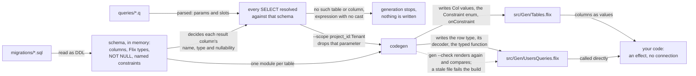
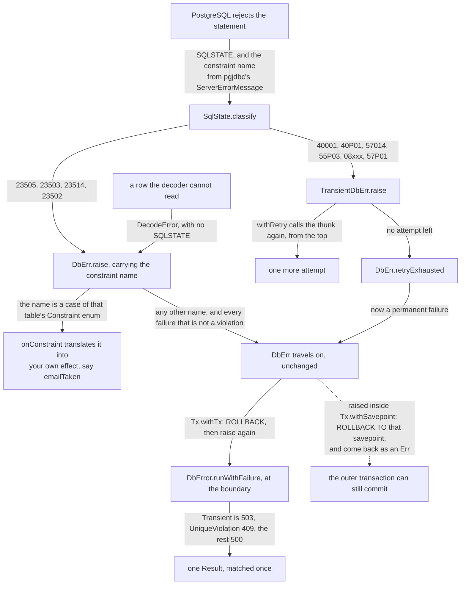
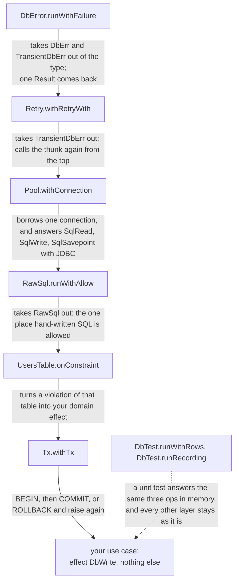
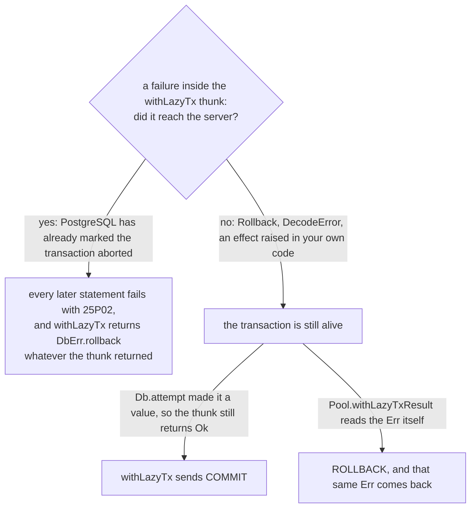

# sqlfx

*日本語版はこのページの[下半分](#sqlfx日本語)にあります。英語版が正。*

**A PostgreSQL database library for [Flix](https://flix.dev).** You write the SQL; sqlfx types
what happens *between* the statements. A `.q` file of plain SQL becomes typed functions with row
types and decoders, reading and writing are two different effects, and a database failure is an
effect you catch where you want to. Built with Flix 0.75.3.

Under `[dependencies]` in your `flix.toml`:

```toml
"github:ababup1192/sqlfx" = { version = "0.4.6", security = "unrestricted" }
```

You write the query in a `.q` file, next to the `migrations/` that define the schema:

```
query findUser(id: Int64) -> one {
    SELECT id, name, email, role FROM users WHERE id = :id AND deleted_at IS NULL
}
```

`bin/flix run -- gen migrations/ queries/ src/Gen/` reads the DDL, checks the SELECT against it,
and writes this — a row type, a decoder, and a function:

```flix
pub type alias FindUserRow = { id = Int64, name = String, email = Option[String], role = String }
pub def findUser(id: Int64): Option[FindUserRow] \ DbRead
```

`email` is `Option[String]` because the column is nullable in the DDL, and `\ DbRead` says the
function reads and can fail. Your own code carries the effect and nothing else — no connection, no
session object:

```flix
def greet(id: Int64): String \ DbRead =
    match UsersQueries.findUser(id) {
        case Some(user) => "hello, ${user#name}"
        case None       => "no such user"
    }
```

Where that runs is decided by the handler you wrap around it, at one place in the program:

```flix
Pool.withConnection(pool, _ -> greet(1i64))          // production: a real PostgreSQL
DbTest.runWithRows(rows, () -> greet(1i64))          // a unit test: the rows you decided
DbTest.runRecording(rows, 0, () -> greet(1i64))      // a unit test: returns (a, List[Statement])
```

| | |
|---|---|
| Install | `"github:ababup1192/sqlfx" = { version = "0.4.6", security = "unrestricted" }` under `[dependencies]` in `flix.toml` |
| Runnable example | [`examples/blog`](examples/blog) — the same blog written twice, once from `.q` and once in raw SQL, with tests against a real PostgreSQL |
| Design notes | [`docs/design.md`](docs/design.md) (why), [`docs/layer0.md`](docs/layer0.md) (`Sql` / `Decoder` / the effects), [`docs/layer1.md`](docs/layer1.md) (`.q` and the generator) |

`security = "unrestricted"` is required because sqlfx talks to JDBC through Java interop. The short
form (`= "0.4.6"`) is rejected by Flix for a package that does.

The JDBC driver and the pool are not vendored, so name them yourself — the SLF4J binding is there
because HikariCP logs through SLF4J and will otherwise print a warning to stderr on first use,
which a Flix test run counts as a failure:

```toml
[mvn-dependencies]
"org.postgresql:postgresql" = "42.7.4"
"com.zaxxer:HikariCP" = "5.1.0"
"org.slf4j:slf4j-nop" = "1.7.36"
```

## API at a glance

Four effects are the whole vocabulary. Two say what a function does to the database, two say how it
can fail:

| Effect | Meaning |
|---|---|
| `SqlRead` | Issues a SELECT. Its op returns a `Result`, and `Sql.*` raises the error side for you |
| `SqlWrite` | Issues an INSERT / UPDATE / DELETE |
| `TransientDbErr` | Failed, and running it again might work — deadlock, timeout, connection lost |
| `DbErr` | Failed, and running it again will not help — a constraint violation, a decode error |

You almost always write one of the three aliases instead, because a function that reads also needs
the two failure effects:

| Alias | Expands to |
|---|---|
| `DbRead` | `{SqlRead, TransientDbErr, DbErr}` |
| `DbWrite` | `{SqlWrite, TransientDbErr, DbErr}` |
| `Db` | `{SqlRead, SqlWrite, TransientDbErr, DbErr}` |

Writing `\ DbRead` on a function that writes is a compile error, which is the point: the signature
is the audit. Three more effects appear only where you asked for them — `RawSql` on a function that
passes a SQL string by hand, `SqlSavepoint` on one that uses `Tx.withSavepoint`, and `TimeZone` on
one that turns an instant into a calendar day.

The types you will see in a signature:

| Type | What it is |
|---|---|
| `SqlValue` | One value on the wire, in either direction. One enum, listed under [raw SQL](#drop-to-raw-sql-and-see-it-in-the-type) |
| `Row` | One row of a result before decoding, detached from the connection: a column-name index and the cells. `Row.get(name, row)` reads one |
| `Decoder[a]` | How to turn a `Row` into an `a`. Built with `forA` over `Decoder.int64("id")` and friends |
| `<Query>Row` | A generated row type, one per `.q` query: a plain Flix record, `FindUserRow` above |
| `Col[table, a, n]` | A generated column: which table it belongs to, its Flix type, and `NotNull` or `Nullable` |
| `Pred[table]` / `Order[table]` / `Changes[table]` | A **fragment** — a piece of SQL built as a value and dropped into a `{slot}` in a `.q` query |
| `Pool` | A HikariCP pool. Open once at startup, close at shutdown |
| `Failure` | A database failure collapsed into a value at the boundary: `Transient(TransientKind)` or `Permanent(DbErrorKind)` |

Two words are used throughout in a specific sense. A **fragment** is a predicate, an ordering or a
SET clause built as a typed value rather than a string, and put into a `{slot}` the `.q` query
declared. An **op** is one operation of an effect — `SqlRead` has one (`fetch`), `SqlWrite` has two
(`execute`, `executeReturning`) — and a handler is a set of answers to them.

## What you can do with it

### Write the SQL, and get back a typed function

`.q` is the default road. `bin/flix run -- gen migrations/ queries/ src/Gen/` runs this:



Every type in the generated code is read off the DDL, and a query the schema cannot account for
stops the build instead of failing at run time.

A query with two or more parameters takes a record, so two `String`s cannot be swapped by accident:

```flix
UsersQueries.insertUser({ name = "alice", email = "alice@example.com", role = "member" })
```

### Say NULL with `Option[T]`, never with a sentinel

A parameter that may be SQL `NULL` is declared `Option[T]`. `Some(v)` sends the value, `None` sends
a *typed* NULL through JDBC's `setNull`:

```
query insertApiKey(name: String, role: Option[String], expiresAt: Option[Timestamp]) -> one {
    INSERT INTO api_keys (name, role, expires_at) VALUES (:name, :role, :expiresAt) RETURNING id
}
```

```flix
ApiKeysQueries.insertApiKey({ name = "ci", role = Some("editor"), expiresAt = None })
```

So there is no `nullif(:role, '')` and no `nullif(:expiresAtMillis, 0)`. A sentinel cannot tell a
real empty string, or a real 1970-01-01, apart from "absent", and one day a row holds the real one.

The trap this leaves is SQL's own: **`WHERE col = :param` never matches NULL.** `None` returns zero
rows, quietly, with no error. sqlfx does not rewrite your SQL, so write the other form yourself:

```sql
-- no rows when :role is None
WHERE role = :role

-- NULL matches NULL
WHERE role IS NOT DISTINCT FROM :role
```

An `Option` parameter sitting in a predicate (WHERE / ON / HAVING) at `= :param` or `<> :param`
makes `gen` print a `warning:` line — it does not stop generation, because the form is legal SQL.
`SET col = :param` is how you write a NULL, so that one is not counted.

### Assert NOT NULL on an expression column

The generator has no table of PostgreSQL's return types, so an expression column needs a cast and a
name: `expr::type AS name`. With only the cast the result is `Option[T]`, because most expressions
can be NULL. When you know it cannot be, put `!` immediately after the cast — two queries as they
are written in a `.q`:

```
query countUsers() -> one { SELECT count(*)::bigint! AS total FROM users }      -- total = Int64
query maxViews() -> one { SELECT max(views)::bigint AS top FROM posts }         -- top = Option[Int64]
```

`count(*)` over no rows is 0; `max(views)` over no rows is NULL — which is exactly the difference
the `!` records. The claim is checked at run time: a NULL arriving in a column you marked fails with
`DbErr.decodeError`, rather than silently becoming 0.

### Build a predicate at run time without building a string

A `{slot}` in a `.q` query takes a fragment. Columns can only come from the generated
`UsersTable.name()`, so there is no identifier to inject, and every value becomes a `$n` parameter:

```flix
def activeUsersNamed(search: { prefix = String, limit = Int64 }): List[SearchUsersRow] \ DbRead =
    UsersQueries.searchUsers(
        search#limit,
        Fragment.when(search#prefix != "", Fragment.like(UsersTable.name(), search#prefix + "%")),
        Fragment.asc(UsersTable.name()))
```

The query that declared the slots, and the SQL that reaches PostgreSQL:

```
  query searchUsers(limit: Int64) -> many with filter: Pred[users], order: Order[users] {
      SELECT id, name, email, role FROM users WHERE deleted_at IS NULL AND {filter} {order} LIMIT :limit
  }

  SELECT ... WHERE deleted_at IS NULL AND ((deleted_at IS NULL) AND (name LIKE $2))
             ORDER BY name ASC, id DESC
             LIMIT $1                                  params: [10, "a%"]
```

Everything you can put in one:

| Comparison | Predicate | Ordering |
|---|---|---|
| `=== =!= << <<= >> >>=` (left is a column, right is a column or `value(x)`) | `like` `inList` | `asc` `desc` |
| | `isNull` `isNotNull` (nullable columns only) | `thenAsc` `thenDesc` — `asc(a) \|> thenDesc(b)` |
| | `both` `either` `negate` (`and` `or` `not` are Flix keywords) | `unordered()` |
| | `when(cond, pred)` `all(preds)` `any(preds)` `always()` | |
| | `rawPred(sql)` — adds `RawSql` to the caller | |

The type is `Col[UsersTable, String, NotNull]`: the table, the Flix type, and whether the DDL said
`NOT NULL`. All three are enforced:

```flix
use Fragment.{===, >>};   // once, at the top of the file or the module

UsersTable.id() === Fragment.value(3i64)           // (id = $1)
UsersTable.deletedAt() >> UsersTable.createdAt()   // (deleted_at > created_at), no parameter
Fragment.isNotNull(UsersTable.email())             // fine: email is nullable
Fragment.isNotNull(UsersTable.name())              // type error: name is NOT NULL
UsersTable.id() === Fragment.value("3")            // type error: Int64 against String
PostsTable.userId() === UsersTable.id()            // type error: different tables — join in the .q
Fragment.value(1) === UsersTable.id()              // type error: the left side is a column
```

`>` `<` `==` cannot be redefined in Flix, so `=` and `<>` are spelled `===` and `=!=` as in Slick,
and the orderings double the character. `>>` is also Prelude's function composition; it means column
comparison only in a scope that wrote `use Fragment.{>>}`.

### Update only the fields the form touched

A SET clause is a slot too, so "save the fields the user edited" does not need one query per
combination of fields:

```
query updatePost(id: Int64) -> exec with changes: Changes[posts] {
    UPDATE posts SET updated_at = now(), {changes} WHERE id = :id
}
```

```flix
type alias PostEdit = { title = Option[String], body = Option[String], published = Option[Bool] }   // None = untouched

def editPost(id: Int64, edit: PostEdit): Int32 \ DbWrite =
    Fragment.noChange()
        |> Fragment.setIfSome(PostsTable.title(), edit#title)
        |> Fragment.setIfSome(PostsTable.body(), edit#body)
        |> Fragment.setIfSome(PostsTable.published(), edit#published)
        |> PostsQueries.updatePost(id)               // SET updated_at = now(), title = $2 WHERE id = $1
```

| Function | SQL | What the type enforces |
|---|---|---|
| `set(col, x)` | `col = $n` | the column's type |
| `setNull(col)` | `col = NULL` | nullable columns only |
| `setIfSome(col, opt)` | `Some` assigns, `None` leaves it alone | for a form field that was not filled in |
| `setOrNull(col, opt)` | `Some` assigns, `None` writes NULL | for writing a row value back; nullable columns only |
| `increment(col, by)` | `col = col + $n` | numeric columns only |
| `rawSet(sql)` | passed through | adds `RawSql` to the caller |

**`setIfSome` and `setOrNull` are the one pair worth reading twice.** A SELECT row type holds a
nullable column as `Option[a]`. Handing that to `setIfSome` type-checks, and turns "this is NULL"
into "do not change this". Writing a row back is `setOrNull`.

### Drop to raw SQL, and see it in the type

A CTE, a DDL statement, `SET`, `EXPLAIN`, or a one-off query cannot be written in `.q`. Pass the
string to `Sql.fetch` / `Sql.execute` instead. Those carry the `RawSql` effect, and it propagates to
every caller, so the places that depend on hand-written SQL can be listed from the signatures, and
the boundary where somebody wrote `RawSql.runWithAllow` is the place to audit:

```flix
use SqlValue.SqlValue

def renameUser(user: { id = Int64, name = String }): Int32 \ DbWrite + RawSql =
    Sql.execute("UPDATE users SET name = $1 WHERE id = $2", List#{SqlValue.Str(user#name), SqlValue.Int64(user#id)})
```

To get a typed result back, build a `Decoder` with `forA`. `Decoder.selectClause` renders the SELECT
list from the decoder, so the column names are written once:

```flix
pub type alias User = { id = Int64, name = String, email = Option[String] }

def userDecoder(): Decoder[User] =
    forA (
        id <- Decoder.int64("id");
        name <- Decoder.str("name");
        email <- Decoder.opt(Decoder.str("email"))      // NULL becomes None
    ) yield { id = id, name = name, email = email }

def findUserByEmail(email: String): Option[User] \ DbRead + RawSql =
    Sql.fetchOneAs(userDecoder(), "SELECT ${Decoder.selectClause(userDecoder())} FROM users WHERE email = $1", List#{SqlValue.Str(email)})
    // => SELECT id, name, email FROM users WHERE email = $1
```

| Function | Returns | Effects |
|---|---|---|
| `Sql.fetch` / `fetchOne` | `List[Row]` / `Option[Row]` | `DbRead + RawSql` |
| `Sql.fetchAs` / `fetchOneAs` | `List[a]` / `Option[a]`, through a `Decoder[a]` | `DbRead + RawSql` |
| `Sql.execute` | rows affected, `Int32` | `DbWrite + RawSql` |
| `Sql.executeReturningAs` / `executeReturningOneAs` | `List[a]` / `Option[a]` from RETURNING | `DbWrite + RawSql` |

A failed decode raises `DbErr.decodeError`. There are four ways to fail — no such column, wrong
type, NULL in a column the decoder says is not nullable, and text that is not JSON — and none of
them is silent.

`SqlValue` is the one enum for a value in either direction:

```
Null  NullOf(NullType)  Bool  Int32  Int64  Float64  Decimal(BigDecimal)  Str  Bytes
Timestamp(epoch µs, UTC)  Date(epoch day)  Uuid  Json  Int64Array  StrArray  Int32Array  JsonArray
```

`Null` is an untyped NULL, which is what a result cell holds. `NullOf(NullType.Str)` is a typed one,
so it survives a position like `col = $1` where PostgreSQL cannot infer the type. From raw SQL, an
optional value is `SqlValue.ofOption(SqlValue.NullType.Str, SqlValue.Str, value)` — the same call a
`.q` `Option[T]` compiles to.

`RawSql` prevents nothing; the SQL you can write is unchanged. It records who is responsible.

### Get values with meaning, not `Int64` and `String`

`TIMESTAMPTZ` decodes to `Timestamp` (an instant, epoch microseconds UTC), `DATE` to `Date` (a
calendar day), `UUID` to `Uuid`, and `JSON` / `JSONB` to the standard library's `Util.Json.Json`.
The wire format is still `SqlValue`, so JDBC and the test handlers do not change.

```flix
Timestamp.now() |> Timestamp.plus(Time.Duration.days(7))              // \ Clock
PostsTable.publishedAt() <<= Fragment.value(Timestamp.now())          // compares in a fragment
Timestamp.format(Format.iso8601Minute(), row#createdAt)               // "2026-09-06 10:00". \ TimeZone
Timestamp.toCivil(row#createdAt)#date                                 // the calendar day there. \ TimeZone
Date.fromYmd({ year = 2026, month = 2, day = 30 })                    // None: that day does not exist
Timestamp.at("2026-09-06T01:00:00Z")                                  // for literals; a bad shape is bug!

run { render(posts) } with TimeZone.runWith(zone)                     // once, at the boundary
run { Blog.publishDue() } with TimeTest.runFrozen({ now = "2026-09-06T00:00:00Z", zone = Zone.utc() })
```

- **An instant and a calendar day are different types.** Comparing and adding `Timestamp`s is pure;
  only dropping to a `Date` asks for `TimeZone`.
- **The zone arrives as an effect.** No function returns the system default, so the zone is decided
  exactly where somebody wrote `TimeZone.runWith` — a rendering function does not take it as an
  argument, it shows `\ TimeZone` in its type.
- **A format is `Format.pattern("yyyy-MM-dd HH:mm")`**, over `yyyy M MM MMMM d dd EEEE HH mm ss SSS
  zzz xxx` and `'...'`. `YYYY` and `hh` stop at `bug!`. ISO 8601 is `toIso8601` / `fromIso8601`.
- JSON is `Decoder.json` (to `Util.Json.Json`) or `Decoder.jsonAs` (to any type with `FromJson`).
- `Uuid.random()` is `\ NonDet`; `Uuid.fromString` validates the shape and returns an `Option`.

`src/Time/` and `src/Uuid/` do not depend on the database layer.

### Catch a database failure where you want to

There are two failure effects, split by whether running it again could help. Each has one op,
`raise(kind)`, which does not return:

```flix
pub eff TransientDbErr { def raise(kind: DbErrorKind): Void }   // retrying may work -> withRetry
pub eff DbErr          { def raise(kind: DbErrorKind): Void }   // retrying will not

pub enum TransientKind { case Deadlock, case Timeout(Int32), case ConnectionLost(String) }
pub enum DbErrorKind {
    case Transient(TransientKind)
    case UniqueViolation(String), case ForeignKeyViolation(String), case CheckViolation(String)
    case NotNullViolation(String), case SchemaMismatch(String), case DecodeError(String, String)
    case RetryExhausted(TransientKind, Int32)   // the last failure, and how many times it was called
    case Rollback                               // rolled back on purpose
    case Other(String)
}
```



Every route a failed statement can take, and the three places you can step into it: `withRetry`,
`onConstraint`, and the boundary.

You raise through a function per kind (`DbErr.uniqueViolation(c)`, `DbErr.other(msg)`,
`TransientDbErr.timeout(ms)`, …). A hand-written handler needs one arm, and keeps compiling when a
case is added to `DbErrorKind`:

```flix
run { ... } with handler DbErr {
    def raise(kind, _resume) = Err(kind)
}
```

A constraint violation carries the constraint's name (`NotNullViolation` carries the column). The
name comes from pgjdbc's `ServerErrorMessage`, so it does not depend on the server's locale.

At the boundary — `main`, an HTTP handler, a test — `DbError.runWithFailure` collapses both effects
into one `Result`:

```flix
pub enum Failure { case Transient(TransientKind), case Permanent(DbErrorKind) }

match failure {
    case Failure.Transient(_)                                   => unavailable()     // 503
    case Failure.Permanent(DbErrorKind.UniqueViolation(name))   => conflict(name)    // 409
    case Failure.Permanent(DbErrorKind.RetryExhausted(last, n)) => internalWith(last, n)
    case Failure.Permanent(_)                                   => internal()        // 500
}
```

`DbError.describeFailure(failure)` is the one line a human reads (`DbError.describe(kind)` for a
kind alone). Branch on the match above, never on the wording — a reworded message must not silently
change what a 500 is.

### Translate a constraint violation into a domain error

The generator turns each named constraint in the DDL into a case of a per-table enum, and emits
`onConstraint`, which runs a write while translating violations:

```flix
// generated, in src/Gen/Tables.flix
mod UsersTable {
    pub enum Constraint { case EmailKey /* users_email_key */, case NameLength /* users_name_length */ }
    pub def raiseConstraint(constraint: Constraint): a \ DbErr
    pub def onConstraint(translate: Constraint -> a \ ef1, thunk: Unit -> a \ ef2): a \ ef1 + ef2 + {TransientDbErr, DbErr}
}
```

The translation is a `match` over that enum, so a missing case is a compile error: add a constraint
in a migration, regenerate, and every place that writes to the table stops compiling until it has
decided what the new violation means.

```flix
pub eff RegisterErr {
    def emailTaken(email: String): Void
    def nameTooLong(): Void
}

pub def registerUser(user: NewUser): Int64 \ DbWrite + RegisterErr =
    UsersTable.onConstraint(translateUserConstraint(user), () ->
        UsersQueries.insertUser({ name = user#name, email = user#email, role = "member" }) |> expectRow)

def translateUserConstraint(user: NewUser, constraint: UsersTable.Constraint): a \ RegisterErr = match constraint {
    case UsersTable.Constraint.EmailKey   => RegisterErr.emailTaken(user#email)
    case UsersTable.Constraint.NameLength => RegisterErr.nameTooLong()
}
```

Call `onConstraint` **outside** `Tx.withTx`: PostgreSQL aborts the transaction on the violation, so
translating inside and returning a value makes `withTx` send a COMMIT to a transaction that is
already dead.

The reason to put the length limit in the DDL in the first place is that the `CHECK` is the only
thing every path goes through — a batch job, a psql session, the next application. Validation in the
language exists so a form can report several errors at once, not as the defence.

```sql
ALTER TABLE users ADD CONSTRAINT users_name_length CHECK (length(name) <= 50) NOT VALID;
-- count and fix the offending rows: SELECT count(*) FROM users WHERE NOT (length(name) <= 50)
ALTER TABLE users VALIDATE CONSTRAINT users_name_length;
```

`NOT VALID` first, then `VALIDATE`: one `ADD CONSTRAINT` against an existing table fails if a single
row is in breach. And name the constraints you want to branch on — without `CONSTRAINT name`,
PostgreSQL invents one and you are guessing.

### Roll back part of a transaction

`Tx.withSavepoint(name, thunk)` wraps a thunk in `SAVEPOINT name`. A failure inside rolls back to
the savepoint and comes out as `Err`; success releases it and comes out as `Ok`. A `statement_timeout`,
a constraint violation or an aborted statement inside stays inside, and a `SET LOCAL` /
`set_config(…, true)` placed inside goes back to what it was:

```flix
/// A five-second aggregate, whose failure stays its own. The outer Tx can still commit.
def countEntries(scope: ProjectId): Result[Failure, Int64] \ DbRead + SqlSavepoint + RawSql =
    Tx.withSavepoint("agg", () -> {
        discard Sql.fetch("SELECT set_config('statement_timeout', '5000', true)", Nil);
        Sql.fetchOneAs(Decoder.int64("n"), "SELECT count(*) AS n FROM entries WHERE project_id = $1", List#{SqlValue.Str(scope)})
            |> Option.getWithDefault(0i64)
    })
```

A read-only transaction can hold one too — it adds `SqlSavepoint`, not `SqlWrite`. Savepoints nest:
an inner failure rewinds to the inner savepoint, an outer one takes the released inner writes with
it. `name` matches `^[a-z_][a-z0-9_]*$` up to 63 characters; anything else returns
`Err(Permanent(Other("invalid savepoint name: …")))` without issuing SQL, and it is the only value
that is ever spliced into the statement text.

### Apply migrations from the same files the generator reads

`migrations/*.sql` go to the database through `migrate`. The generator parses these files; `migrate`
does not — it hands them to JDBC as they are, so functions and triggers apply too. Forward only,
recorded in `sqlfx_migrations(version, checksum, applied_at, execution_ms, applied_by)`:

```bash
$ SQLFX_DSN=jdbc:postgresql://127.0.0.1:5432/blog SQLFX_USER=flix SQLFX_PASSWORD=flix \
    bin/flix run -- migrate migrations/            # apply what is pending, in order
    bin/flix run -- migrate --check migrations/    # exit 1 on pending, mismatched or missing (CI, and before boot)
    bin/flix run -- migrate --status migrations/   # list
$ bin/flix run -- migrate new migrations/ add_note   # write 004_add_note.sql; no database needed
```

- A file is `NNN_name.sql`, zero-padded to at least three digits, so sorting by name sorts by number.
  A file the table has never seen is applied even if its number is low — that is a branch merging in.
- Two files with the same number stop at `duplicateNumber`. Renumber one with `migrate new`.
- One file, one transaction, with the bookkeeping INSERT inside it. "Applied but not recorded" cannot
  happen. A file that fails leaves itself and everything after it pending.
- A file whose first line is `-- sqlfx:no-transaction` runs without one, for `CREATE INDEX
  CONCURRENTLY`. Keep it to a single statement and make it idempotent with `IF NOT EXISTS`.
- An applied file that has since been edited stops at `checksumMismatch` (CRLF, trailing whitespace
  and trailing blank lines are ignored). A recorded file that is gone is `missingFile`.
- It opens its own connection, sets `lock_timeout` (10 seconds by default) and takes a
  `pg_advisory_lock` before applying, so several instances booting at once apply one at a time. It
  never uses the pool.

From inside the application it is `Migrate.apply(Migrate.defaultConfig(config), "migrations")` and
`Migrate.check(conn, "migrations")` — apply from the deployment step, check at boot. Failures are
`DbErr` and `MigrateErr` (`checksumMismatch` / `missingFile` / `invalidFileName` / `duplicateNumber`
/ `pending`); `Migrate.runWithResult` collapses them at the boundary.

### Run the same function against rows you decided

Nothing about a use case changes between production and a test; you swap the handler.

```flix
// return the rows you chose. This tests the decoding and the logic
DbError.runWithFailure(() -> DbTest.runWithRows(rows, () -> findUserByEmail("alice@example.com")))

// vary the rows per statement, and record what was issued. An N+1 regression fails on a count
let (grouped, statements) = DbTest.runRecordingWith(rowsFor, 0, () -> DbError.runWithFailure(() -> Blog.usersWithPosts(10i64)));
Assert.assertEq(expected = 2, List.length(statements))

// a handler that fails checks the translation into a domain error, still with no database
run {
    DbError.runWithFailure(() -> Blog.registerUser({ name = "alice", email = "alice@example.com" }))
} with handler SqlWrite {
    def execute(_sql, _params, resume) = resume(Ok(0))
    def executeReturning(_sql, _params, resume) = resume(Err(DbErrorKind.UniqueViolation("users_email_key")))
}
```

`runWithRows`, `runWithTable`, `runRecording`, `runRecordingWith`, `runLogging` and
`runFailingWrite` are in `DbTest`. Tests that need a real PostgreSQL go in `test/Pg/`, where
`make test-pg` brings a container up around them; loading fixed data and comparing a whole query
result reads best ([`examples/blog/test/Pg/TestQueriesPg.flix`](examples/blog/test/Pg/TestQueriesPg.flix)).
Flix records have no `Eq`, so map an expected row onto an enum — `Views.user({ id = …, name = … })` —
before comparing.

### Fetch a relation without N+1

`Preload.attach` groups children fetched by one `IN` query under their parents, in the parents'
order, with `Nil` for a parent that has none:

```flix
pub def usersWithPosts(limit: Int64): List[UserWithPosts] \ DbRead =
    let users = UsersQueries.searchUsers(limit, Fragment.always(), Fragment.asc(UsersTable.id()));
    Preload.attach({
        parents = users,
        parentKey = user -> user#id,
        children = PostsQueries.postsByUsers(List.map(user -> user#id, users)),
        childKey = post -> post#userId
    }) |> List.map(pair -> { let (user, posts) = pair; { user = user, posts = posts } })
```

The child query declares `keyed(user_id)` — the column the results are grouped by. Today the
generator only checks that the column is in the result; generating the preloader from `keyed` is not
done yet, so the two calls above are written by hand. `DbTest.runRecordingWith` counting two
statements is what keeps it from drifting back to N+1.

## The `.q` file and the scope rules

### The shape of a `.q` file

```
// a line comment
query name(param: Type, ...) -> one | many | exec [keyed(column)] [with slot: Pred[table] | Order[table] | Changes[table], ...] {
    plain SQL. :name is a parameter, {slot} is a fragment
}
```

| Shape | Returns | Statements it accepts |
|---|---|---|
| `-> one` | `Option[Row]` | SELECT, and INSERT / UPDATE / DELETE with `RETURNING` |
| `-> many` | `List[Row]` | the same |
| `-> exec` | `Int32`, rows affected | INSERT / UPDATE / DELETE without `RETURNING` |

Parameter types are spelled as in Flix: `Bool Int32 Int64 Float64 BigDecimal String Bytes Timestamp
Date Uuid Json List[Int32] List[Int64] List[String] List[Json]`. Any of them can be wrapped in
`Option[T]`; nesting the wrapper (`Option[Option[…]]`) cannot be written. `List[Json]` (`jsonb[]`)
and `List[Int32]` (`integer[]`) exist for passing many rows in one statement through `unnest(:rows)`.

The rules the parser holds you to:

- A `:name` that was not declared is an error, and so is a declared parameter that is never used.
  A `::type` cast and anything inside `'...'` are left alone, so neither is read as a parameter.
- The same `:name` twice is the same `$n`.
- `--` to end of line is a comment.
- Query, parameter and slot names become Flix identifiers, so a keyword (`type`, `alias`, `run`, …)
  or an internal name (`sql`, `params`) stops generation.
- `keyed` is only allowed on `many`.
- `Changes[t]` is only allowed in a `-> exec` UPDATE, on the table the UPDATE names. RETURNING with a
  `Changes` slot is not implemented.

The `!` marker goes immediately after a cast. `count(*)!` (no cast), `id!` (a column reference) and
`::bigint !` (a space) all stop at `MisplacedNotNullMark`. It works after `FILTER (…)::bigint!`,
after `OVER (…)::bigint!`, and with an alias written without `AS`. A column reference can carry it
too if you write the cast — `email::text! AS email` for a nullable column your WHERE already
excluded, or the far side of a LEFT JOIN. `!=` and `!~`, and a `!` inside `'...'`, are not markers.

A function in FROM, such as `unnest(:ids, :rows) AS v(id, data)`, passes as a table source whose
columns are unknown, the same as a subquery — so `UPDATE … FROM unnest(...)` can be written as an
`exec`. Selecting one of its columns needs the cast: `v.data::jsonb! AS data`.

### What the DDL reader understands

From `migrations/*.sql` the generator reads `CREATE TABLE`, `DROP TABLE`, and `ALTER TABLE` with
ADD / DROP / ALTER COLUMN, RENAME COLUMN, and ADD / DROP CONSTRAINT. `ALTER COLUMN` is read rather
than warned about, because generating code from a stale nullability or type is a decode error at run
time.

Constraints are what become the per-table `Constraint` enum, and only named ones can:
`CONSTRAINT name UNIQUE | CHECK | FOREIGN KEY | REFERENCES`, plus
`CREATE UNIQUE INDEX name` (a violation comes back under the index's name). An **unnamed** UNIQUE,
CHECK or REFERENCES stops generation with `UnnamedColumnConstraint` / `UnnamedTableConstraint` —
rather than being dropped, which is what would leave you branching on a name PostgreSQL invented.
`PRIMARY KEY`, `NOT NULL` and `EXCLUDE` are outside this, named or not; a primary key violation is
not a case you translate, and `NOT NULL` is already the parameter's type.

Anything else is a warning, not a failure. `migrate` applies the whole file regardless, so a
function or a trigger can live in the same migration without the generator having to understand it.

### Keeping every query inside a tenant

`gen --scope project_id` fails generation for any query that touches a table having a `project_id`
column without naming that column. This is the multi-tenant write you forgot, caught at build time
rather than by a customer seeing another customer's rows.

`gen --scope project_id:Tenant` adds an effect name, and then does one more thing: it removes that
column's value from the generated function's parameters and takes it from the effect instead.

```
// scope: explicit no Tenant yet, this runs during login
query findMembership(projectId: Int64, userId: Int64) -> one { ... WHERE project_id = :projectId AND user_id = :userId }

query listEntries(projectId: Int64, limit: Int64) -> many { SELECT ... FROM entries WHERE project_id = :projectId LIMIT :limit }
```

```flix
pub def findMembership(args: { projectId = Int64, userId = Int64 }): Option[FindMembershipRow] \ DbRead
pub def listEntries(limit: Int64): List[ListEntriesRow] \ DbRead + Tenant   // let projectId = Tenant.currentId();
```

Callers of `listEntries` can no longer pass somebody else's project id, because there is nowhere to
pass it. You supply the effect: `pub eff Tenant { def current(): ... }` with
`Tenant.currentId(): Int64 \ Tenant`. A namespaced name (`Cms.Tenant`) works too.

- A parameter is removed only if its name is the column in camelCase (`project_id` → `projectId`),
  its type is a required `Int64`, and the query touches a table that has the column. A differently
  named parameter, or a form like `project_id IN (...)`, stays as it is.
- A parameter with the right name and the wrong type (`String`, `Option[Int64]`, `Int32`) stops
  generation at `UninjectableParam`, rather than being silently left alone.
- `--scope` repeats (`--scope project_id:Tenant --scope org_id:Org`). Each column is judged on its
  own, and a query touching a table with both columns gets both effects.
- After the removal, a query left with one parameter takes it directly, and one left with none takes
  no arguments at all.

### The two markers

A query that means to cross the scope says so on the line before it:

| Marker | Effect |
|---|---|
| `// unscoped: <reason>` | This query may touch the table without the condition |
| `// scope: explicit <reason>` | Check it as usual, but keep the parameter — for a context that has no `Tenant` yet, such as login |

Both take an optional column before the reason (`// unscoped: org_id crosses organizations`), which
narrows them to that column; without one they apply to every `--scope` column. Because of that, a
reason *beginning* with a schema column name is read as the column — `// unscoped: title で引く`
stops at `MarkerColumnNotScoped` — and the fix is to name the column first.

Between the marker and its `query` you may have `//` comments and blank lines and nothing else. A
marker with no query after it stops at `DanglingMarker(line)`, so a marker cannot silently lose its
target when somebody reorders the file.

## Wiring it into a server

Everything sqlfx needs decided lives at the entry point; the functions in between take an effect and
nothing more.



Each layer answers one effect and removes it from the type, and only the layer that answers
`SqlRead` / `SqlWrite` is swapped in a test.

```flix
let pool = Pool.open(Pool.defaultConfig(config));   // once at startup; Pool.close at shutdown
```

`Pool.defaultConfig(connection)` is `{ connection, maxConnections = 10, borrowTimeoutMs = 5000,
leakDetectionThresholdMs = 0 }`, over a `{ url, user, password }`. `Pool.open` does not connect; the
first borrow does. For a CLI or a test that connects once, `Jdbc.withConnection(config, conn -> …)`
skips the pool entirely.

Stack the four outer ones at the edge shared by every HTTP handler. What each handler writes for
itself is the validation, the transaction boundary, and the constraint translation. Domain errors
(`RegisterErr` and the like) are translated in the service layer and mapped to a status in the
controller; [`examples/blog/src/BlogForm.flix`](examples/blog/src/BlogForm.flix) shows them joined
with validation errors under one type. `DbTest.runLogging` at the same edge records the statements
and their row counts.

## How transactions, retries and effects resolve

### Which transaction entry point

| | When |
|---|---|
| `Tx.withTx(conn, thunk)` | You already hold a connection. BEGIN, COMMIT, ROLLBACK and re-raise on failure |
| `Pool.withLazyTx(pool, thunk)` | Borrow and BEGIN when the first statement arrives; COMMIT or ROLLBACK at the end. A thunk that issues nothing never touches the pool — for a unit like a GraphQL resolver, where you do not know until you run it whether the database is involved |
| `Pool.withLazyTxResult(pool, thunk)` | The same, for a thunk returning `Result`: `Err` rolls back and **that same `Err` comes back** |
| `Pool.withLazyTxAfterBegin(pool, onBegin, thunk)` | The same, with one statement run in the transaction right after BEGIN — `SELECT set_config('app.project_id', $1, true)` for an RLS marker |
| `Tx.withSavepoint(name, thunk)` | Inside a transaction, to rewind part of it |

Nested transactions are not supported; rewinding part of one is `Tx.withSavepoint`. Retrying is per
transaction, because PostgreSQL aborts the whole transaction on a deadlock and a per-statement retry
would mean nothing. An error that only surfaces at COMMIT, such as a deferred constraint, is
translated too, and the connection goes back to autocommit.

### Where a failure may become a value

`Db.attempt(thunk)` gives you a `Result` per call — for a batch that collects an outcome per row:

```flix
rows |> List.map(row -> (row, Db.attempt(() -> UsersQueries.insertUser(row))))
```



Whether the failure reached the server decides what a `Result` inside the transaction means, and
only `withLazyTxResult` ties that value back to the rollback.

**`Db.attempt` does not roll anything back**, so use it outside a transaction, or inside
`Pool.withConnection`. To turn a failure into a value *inside* one, use `Pool.withLazyTxResult`:

```flix
// receive RegisterErr (a domain error effect) inside the Tx, and roll back on Err
DbError.runWithFailure(() ->
    Pool.withLazyTxResult(pool, () -> RegisterErr.runWithResult(() -> registerUser(user))))
//   : Result[Failure, Result[RegisterFailure, Int64]]
```

**Never handle a domain error outside the transaction.** A Flix effect that does not resume simply
drops the frames in between — there is no `finally` — so handling it outside skips `withLazyTx`'s
COMMIT / ROLLBACK and the return of the connection, and the connection leaks as *idle in
transaction*. The same rule applies inside `Tx.withSavepoint`: catch it in the thunk and turn it into
a `DbErr` or into the return value, for example
`Tx.withSavepoint("s", () -> BizErr.runWithResult(work))`.

### Shapes that break, measured

| Shape | What happens |
|---|---|
| `try { run … with handler X { … } } catch { … }` | An exception thrown inside the handler, or after resuming from an op, sails past the `catch`. Put the `catch` **inside** the handler, innermost |
| `catch { case e: Throwable => SomeEff.op(...) }` | A JVM `VerifyError`. Return a value from the catch arm and call the op after leaving it |
| `def f(thunk: Unit -> a \ ef): a \ ef + DbErr` where `ef` is `DbErr` | E6217. A function with an effect variable cannot also declare that effect |
| A handler that never resumes | Legal, but a `Void` op cannot be resumed, so nothing after that op runs |

JVM exceptions do not appear in a type. `Pool.withLazyTx` catches them innermost inside its own
handler and turns them into `DbErr`'s `Other` (a `VirtualMachineError` such as `OutOfMemoryError` is
re-thrown). **That catch does not reach inside a handler you installed in the thunk** — the first row
of the table above, happening at the boundary between the library and you:

```
   Pool.withLazyTx(pool, thunk)
     └─ run … with handler SqlRead / SqlWrite      ← the library's handler
          └─ catch (Db.guard)                      ← catches down to here
               └─ BizErr.runWithResult(…)          ← your handler
                    └─ Session.runWith(…)
                         └─ throw RuntimeException  ← past the library's catch: no COMMIT, no ROLLBACK, no return to the pool
```

So if the thunk installs handlers of your own, put `Db.guard` directly inside the innermost one. It
makes the same judgement the library does — fatal is re-thrown, everything else becomes
`DbErr.other`, falling back to the class name when there is no message — and the resulting `DbErr`
rides the normal ROLLBACK path:

```flix
Pool.withLazyTxResult(pool, () ->
    BizErr.runWithResult(() ->
        Session.runWith(actor, () ->
            Db.guard(() -> work()))))        // inside the handler nearest the thing that can throw
```

One place is enough — the innermost. Anything thrown under an outer handler happened inside that
handler, where the library's own catch reaches it. The test is
`testPoolLazyTxGuardInsideUserHandler` in [`test/Pg/TestPool.flix`](test/Pg/TestPool.flix).

### What must not go inside a retried thunk

**No side effect other than the database belongs in a `withLazyTx` or `withRetryWith` thunk** — no
HTTP request, no file, no outward effect. A retry re-runs the whole thunk, so it happens twice. Put
it in an outbox instead: a row written in the same transaction, picked up and sent by a later tick.
Types cannot stop this, so watch the thunk's effect set on your side; an I/O effect in a signature
that should read `\ {Db, …}` is the thing to look for.

### Backoff and jitter

`withRetry` calls again immediately, so a database that is restarting burns all three attempts in
milliseconds. `Retry.withRetryWith(policy, wait, jitter, thunk)` waits
`wait(backoffMs(policy, attempt, jitter()))` before each retry, and not after the last failure. The
wait is full jitter — a random 0.0–1.0 times `min(maxMs, baseMs * 2^(attempt-1))` — so requests that
failed together do not come back together.

```flix
/// the jitter source. A lambda, `() -> Math.Random.randomFloat64()`, is fine too
def jitter(): Float64 \ Math.Random.Random = Math.Random.randomFloat64()

def countRows(pool: Pool.Pool): Int32 \ {IO, DbErr, RawSql} =
    Math.Random.runWithIO(() ->
        Retry.withRetryWith(Retry.defaultPolicy(), Retry.sleepMs, jitter, () ->   // 3 attempts, 100 ms doubling, capped at 2 s
            Pool.withConnection(pool, _ -> Sql.fetch("SELECT 1", Nil) |> List.length)))
```

`Retry.Policy` is `{ attempts = Int32, baseMs = Int32, maxMs = Int32 }` and `Retry.defaultPolicy()`
is `{ attempts = 3, baseMs = 100, maxMs = 2000 }`. `Retry.sleepMs` wraps `Thread.sleep` and stops
waiting when interrupted. `Retry.backoffMs` is pure, so a test can pass a `wait` that only records
the milliseconds and a fixed `jitter`, and assert on the schedule without sleeping.

### Pool numbers, and telling two timeouts apart

`Pool.stats(pool)` is `{ active, idle, waiting, total, max }`, from HikariCP's MXBean and your
`maxConnections`. Before the first connection is opened, and after close, everything is 0 except
`max`:

```flix
def poolIsHealthy(pool: Pool.Pool): Bool \ IO =
    let stats = Pool.stats(pool);
    stats#waiting == 0 and stats#active < stats#max
```

A `TransientDbErr` from `Pool.borrow` means one of two very different things:

- `Timeout` — **the pool's borrow limit**. It was full (`active >= max`) and nothing freed up within
  `borrowTimeoutMs`. The database is presumably fine; suspect a slow statement or a leak.
- `ConnectionLost` — **the database is not reachable**. The pool had room and the connection could
  not be made. Suspect the DSN, the network, or a stopped database.

HikariCP words both as "request timed out", so sqlfx separates them from `Pool.stats` at the moment
of failure together with the cause chain — a `java.net.ConnectException`, a
`java.net.SocketTimeoutException`, or a `PSQLException` whose SQLState starts with `08` means
`ConnectionLost` regardless of the stats. The decision is the pure
`Pool.borrowFailureKind(message, causes, sqlState, stats)`, so it is tested as a table.

`Pool.withConnectionTimeout(pool, borrowTimeoutMs, thunk)` is `withConnection` with a borrow limit
for that one call — for a ping or a health check, which would rather fail than wait. (While the
database is down, a `/health` that waits the pool's full `borrowTimeoutMs` loses to Docker's
HEALTHCHECK timeout.) Do not use it for real work: if the wait there is too long, the setting to
change is the pool's, and giving up only means doing the work again.

`PoolConfig`'s `leakDetectionThresholdMs` (0, disabled, by default) makes HikariCP log an SLF4J
warning with a stack trace for a connection borrowed and not returned within that time. HikariCP
silently ignores anything under 2000, so sqlfx rounds a non-zero value up to 2000. Where the warning
goes is your SLF4J binding's business: `slf4j-nop` drops it, `slf4j-simple` prints it to stderr.

```flix
let pool = Pool.open({ leakDetectionThresholdMs = 10000 | Pool.defaultConfig(config) });
```

## What sqlfx changes without telling you

Small, deliberate, and no flag turns them off:

| | |
|---|---|
| The `!` marker | Stripped from the SQL that is sent, and from the generated doc comment. It is a claim to the generator, not syntax PostgreSQL knows |
| `both(always(), p)` | Folds to `p`, so a `when` that came out false does not leave `TRUE AND` in the statement |
| `inList(col, Nil)` | Renders `FALSE`. An empty IN list is not a syntax error you should have to handle |
| An empty `Changes` | No statement is sent and the call returns 0, even when the UPDATE also has fixed assignments. "No rows matched" is also 0, so read with `one` first if you need to tell them apart |
| The same column assigned twice in a `Changes` | Only the later assignment is emitted. `rawSet` and the fixed assignments written in the `.q` are not folded, so repeating one of those is an error from PostgreSQL |
| A migration's checksum | CRLF, trailing whitespace and trailing blank lines are normalised away before hashing |
| `leakDetectionThresholdMs` | A non-zero value below 2000 is raised to 2000, because HikariCP would otherwise disable it silently |
| A `Timestamp` | Carried as epoch microseconds in UTC, whatever the session's timezone is |

## Design

**The handler is the seam.** `SqlRead` and `SqlWrite` are effects with a handful of ops, so
production, a canned-row test and a recording test are the same function under three handlers.
Nothing in the use case knows which one it is under.

**SQL is not abstracted.** There is no query builder that eventually cannot express what you need.
`.q` holds the statement you would have written, and the generator's job is to attach types to it —
which is also why it refuses to guess: an expression column needs a cast, because inventing
PostgreSQL's return types would be a table that is wrong at the edges.

**Failures are effects, not `Result`.** Three things follow. The rollback path stays single: a
failure returned as a value can be held by an intermediate function in a way that looks like `Ok`,
and then `withLazyTx` commits. The thunk stays written in plain types — `insertUser(row): Int64 \
DbWrite`, no nesting of `Result` and no chain of `forM`. And the only place a failure can be
discarded is a handler, so `run … with handler` is a grep-able list, where `Result.getWithDefault`
scatters. In one sentence: *unless you handle it explicitly, the failure is in the function's type* —
the same aim as Java's checked exceptions, with `\ DbErr` in place of `throws`.

`Result` could express the same thing, but two shapes are easy to get wrong with it.
`List.map(row -> insert(row))` instead of `Result.traverse(insert, rows)` buries one failure inside a
`List[Result[…]]` that the caller has to inspect element by element; and `Result.toOption` flattens
"not found" and "failed" into the same `None`. With effects the first stops at the first failure
while still being written `List.map`, and the second has no route to an `Option`.

**Two failure effects, not one enum with a boolean.** `TransientDbErr` and `DbErr` are separated
because the layer that deals with them is different: `withRetry` handles one and never sees the
other.

**The generator is not a separate package.** `flix.toml` cannot depend on a local path, so the `gen`
and `migrate` CLI lives in this repository's `main` and consumers run it from here. The `.fpkg`
carries only the library (`Db`, `Q/Fragment`, `Time`, `Uuid`) — shipping the generator would put a
`Schema` module in the consumer's namespace, where it would collide.

## Versioning

Semantic versioning, with the `0.x` rule written out because Flix has no established convention yet:

- **While the version is `0.x`, a minor bump may break you.** The upgrade notes below say what moved.
- **Raising the supported Flix version is at least a minor bump**, never a patch.
- Patch releases are fixes that keep the API and the generated code as they were.
- The generated files carry a generator version in their header (`// GENERATED by sqlfx gen v9 …`).
  When the generated output changes shape, that number goes up and `gen --check` fails until you
  regenerate.

### Upgrading from 0.4.5 to 0.4.6

The header becomes `v9` and the generated doc comments are in English, so run `make gen`. No type
changes unless you add a `!`.

| 0.4.5 | 0.4.6 |
|---|---|
| An expression column `count(*)::bigint AS total` is always `Option[Int64]`, and the caller flattens it with `Option.getWithDefault(0i64)` | `count(*)::bigint! AS total` gives `Int64`. Without the `!` it is `Option[Int64]` as before |
| A subquery column `hits.total::bigint AS total` is `Option` too | `hits.total::bigint! AS total` drops the `Option` the same way |
| A misplaced marker reported `UntypedColumn` | `ResolveError.MisplacedNotNullMark(query, expression)` was added (no cast / a bare column reference / a space) |
| `QRender.toSql` returned the `.q` body verbatim | It returns the SQL with `!` removed. The annotated form is `QRender.toAnnotatedSql`, used only by `QResolve` |
| Parameters could be `List[Int64]` and `List[String]` | `List[Int32]` (`integer[]`) and `List[Json]` (`jsonb[]`) were added, with `SqlValue.Int32Array` / `SqlValue.JsonArray` (elements are JSON text; `SqlValue.ofJsonArray` wraps a `List[Json]`), `Decoder.int32Array` / `Decoder.jsonArray`, and the matching `NullType` cases |
| A function in FROM (`unnest(...)`) was `UnknownTable(unnest)` | It passes as a table source with unknown columns, like a subquery (after FROM / JOIN only) |
| The generated header said the hash is checked "by the tests" | It says `gen --check` checks it, which is what happens |
| Generated doc comments, lint messages and `bug!` text were Japanese | They are English. Comments in the sqlfx sources stay Japanese |

### Upgrading from 0.4.4 to 0.4.5

`gen --scope project_id` on its own generates what it did before. Only adding an effect changes the
shape.

| 0.4.4 | 0.4.5 |
|---|---|
| `gen --scope <column>`, once | `gen --scope <column>[:<effect>]`, repeatable. Without `:<effect>` it still only checks |
| The generated function takes `projectId: Int64` and the caller passes `Tenant.currentId()` | With `--scope project_id:Tenant` the parameter is gone and the function calls `Tenant.currentId()` itself; the signature is `\ DbRead + Tenant` |
| A query whose parameters were an `args` record | Removing `projectId` can leave one parameter (passed directly) or none, which changes the call site |
| No way out for a query called where there is no `Tenant` | `// scope: explicit <reason>` keeps the parameter and still checks the query |
| `// unscoped: <reason>` applied to every column | `// unscoped: <column> <reason>` narrows it to one column. `// scope: explicit` reads the same way |
| `Gen.Dirs` had `scope = Option[String]` | `scopes = List[QScope.Scope]`, where a scope is `{ column = String, effect = Option[String] }` |
| `QScope.check(column, …)` | Still there, for checking only. The injections are `QScope.plan(scopes, …)`, and generation is `Codegen.renderQueriesWith(origin, injections, resolved)` |
| `ScopeError` had 3 cases | `MarkerColumnNotScoped(query, column)` and `UninjectableParam(query, param, column, received)` were added |

### Upgrading from 0.4.3 to 0.4.4

| 0.4.3 | 0.4.4 |
|---|---|
| A `//` comment between `// unscoped:` and its `query` silently voided the marker, and only the checked queries failed | Comments and blank lines in between are skipped. A marker with no query after it (another line, end of file, two markers in a row) stops generation with `DanglingMarker(line)` |
| `QScope.unscopedNames(source)` | `QScope.markedNames(prefix = "// unscoped:", source)`, returning a `Result` |

### Upgrading from 0.4.2 to 0.4.3

| 0.4.2 | 0.4.3 |
|---|---|
| A failure in part of a transaction (a `statement_timeout`, say) aborted the whole thing | `Tx.withSavepoint(name, thunk)` rolls that part back to a `SAVEPOINT` and carries on. It is a new effect, `SqlSavepoint`, which is not in the `Db` / `DbRead` aliases, so only the functions that use it write `+ SqlSavepoint` |

### Upgrading from 0.4.1 to 0.4.2

| 0.4.1 | 0.4.2 |
|---|---|
| A thunk returning a value after a statement had failed inside the Tx gave `Ok` (with no rows written) | It rolls back and raises `DbErr.rollback` (`DbErrorKind.Rollback`) |
| 55P03 (`lock_timeout`) and 57P01 (`admin_shutdown`) were `Other` | `Transient(Timeout(0))` and `Transient(ConnectionLost)`, which `withRetry` calls again |
| A JVM exception from `withLazyTxAfterBegin`'s `onBegin` leaked the connection | It becomes `Other` like the thunk's, and the transaction rolls back |

### Upgrading from 0.4.0 to 0.4.1

| 0.4.0 | 0.4.1 |
|---|---|
| `DbErr.runWithResult` returned `Result[String, _]` | `Result[DbErrorKind, _]`; the wording is `DbError.describe(kind)` |
| You wrote your own try/catch inside a handler installed in the thunk | `Db.guard(thunk)` — see [shapes that break](#shapes-that-break-measured) |

### Upgrading from 0.3.x to 0.4.0

| 0.3.x | 0.4.0 |
|---|---|
| The raising functions, `DbErr.uniqueViolation(c)` and the rest | Unchanged; they went from ops to functions |
| `with handler DbErr { def uniqueViolation(c, _) = … }`, eight arms | `with handler DbErr { def raise(kind, _) = … }`, one arm |
| `DbErrorKind.Deadlock` / `.Timeout(ms)` / `.ConnectionLost(m)` | `DbErrorKind.Transient(TransientKind.Deadlock)` and so on |
| `DbErrorKind.RetryExhausted("timeout 0 after 3 attempts")` | `DbErrorKind.RetryExhausted(TransientKind.Timeout(0), 3)` |
| `DbErr.retryExhausted(last: String)` | `DbErr.retryExhausted(last: TransientKind, attempts: Int32)` |
| `DbFailure.Transient(String)` / `DbFailure.Permanent(String)` | `Failure.Transient(TransientKind)` / `Failure.Permanent(DbErrorKind)`; the name `DbFailure` remains as an alias |
| `"${failure}"` to build the wording | `DbError.describeFailure(failure)` |
| `TransientDbErr.runWithResult` returned `Result[String, _]` | `Result[TransientKind, _]` |
| `Pool.borrowFailureKind` returned `DbErrorKind` | `TransientKind` |
| A hand-rolled sentinel plus a `Ref` to roll back on a domain error | `Pool.withLazyTxResult` |
| Wrapping the `withLazyTx` thunk in your own try/catch | Not needed; the library catches innermost |

## When this gets archived

This library was extracted from a headless CMS written in Flix, developed in a private repository.
If that project stops using sqlfx, this repository is archived and the README says so on the first
line. The last released version keeps working — it is a source package pinned to a Flix release,
over a JDBC driver you name yourself. The harm in an unmaintained library is not that it stopped; it
is not knowing whether it stopped. So: that is the condition, written down in advance.

## Development

You need JDK 17 or newer, Docker for the real-PostgreSQL tests, and a Flix 0.75.3 jar. `bin/flix`
looks for the jar in the flix_game_engine devbox profile; `FLIX_JAR=/path/to/flix.jar` overrides
that. It also passes `--Xsubeffecting=lambdas`, without which a pure lambda cannot be handed to a
parameter typed `\ ef` and every pure value needs a `checked_ecast`.

```bash
make check         # type check
make test          # everything: test-unit, then test-pg, then test-examples
make test-unit     # no database. Copies src/ and test/ minus test/Pg into build/unit/ and runs there
make test-pg       # real PostgreSQL. docker compose up, run all of it, down
make test-examples # the tests of examples/blog, which is its own project
make gen           # regenerate examples/blog's src/Gen from its migrations and .q
make gen-check     # check that they are current, writing nothing
make db-up         # bring PostgreSQL up by hand
make db-down       # and down
make pkg           # build the distributable .fpkg
make release       # attach the .fpkg and flix.toml to a GitHub release, tagged from flix.toml
```

`make test-unit` copies rather than moving, so the sources the editor has open never change under
it, and an interrupted run leaves nothing behind. `test/Pg/` stays under `test/` because the VSCode
Flix extension only hands `src/` and `test/` to the language server — which is also why
`examples/blog` has to be opened in its own window.

```
src/Db/           layer 0: SqlValue / Row / Decoder / Sql / DbError / Retry / Tx / Preload
src/Db/Jdbc/      the JDBC handlers, and the SQLSTATE translation table
src/Db/Test/      the test handlers: runWithRows / runWithTable / runRecording / runLogging
src/Q/            layer 1: the .q parser, schema resolution, the fragment DSL, the generator
src/Main.flix     the gen and migrate subcommands
test/             tests without a database. Only test/Pg/ needs a real PostgreSQL
examples/blog/    the demo: its own project, with the generated and the raw-SQL version side by side
docs/             design.md (why) / layer0.md / layer1.md (implementation) / spikes.md (what Flix made us do)
```

`make pkg` packs only the library, not `Main.flix` or the generator, for the namespace reason in
[Design](#design). Consumers who want to try an unreleased build copy the sources the way
`examples/blog/Makefile`'s `vendor` target does.

## License

Apache-2.0

---

# sqlfx（日本語）

**Flix の PostgreSQL 向け DB ライブラリ。** SQL はそのまま書き、文と文の**間**にエフェクトで型を付ける。
素の SQL を書いた `.q` ファイルから、行レコードとデコーダの付いた型付きの関数が出る。読むのと書くのは別の
エフェクトで、DB の失敗もエフェクトなので、拾いたい所でだけ拾う。Flix 0.75.3 で作っている。

> 上の[英語版](#sqlfx)が正。ずれていたらそちらを見る。

`flix.toml` の `[dependencies]` に:

```toml
"github:ababup1192/sqlfx" = { version = "0.4.6", security = "unrestricted" }
```

クエリは、スキーマを決める `migrations/` の隣の `.q` ファイルに書く:

```
query findUser(id: Int64) -> one {
    SELECT id, name, email, role FROM users WHERE id = :id AND deleted_at IS NULL
}
```

`bin/flix run -- gen migrations/ queries/ src/Gen/` が DDL を読み、SELECT を突き合わせて、
行レコード・デコーダ・関数を書く:

```flix
pub type alias FindUserRow = { id = Int64, name = String, email = Option[String], role = String }
pub def findUser(id: Int64): Option[FindUserRow] \ DbRead
```

`email` が `Option[String]` なのは DDL でその列が NULL 可だから。`\ DbRead` は「読む、失敗しうる」。
利用側のコードが持つのはエフェクトだけで、接続もセッションのオブジェクトも持たない:

```flix
def greet(id: Int64): String \ DbRead =
    match UsersQueries.findUser(id) {
        case Some(user) => "hello, ${user#name}"
        case None       => "no such user"
    }
```

どこで走るかは、プログラムの 1 か所で被せるハンドラが決める:

```flix
Pool.withConnection(pool, _ -> greet(1i64))          // 本番。実 PostgreSQL へ
DbTest.runWithRows(rows, () -> greet(1i64))          // 単体。決めた行を返す
DbTest.runRecording(rows, 0, () -> greet(1i64))      // 単体。(a, List[Statement]) が返る
```

| | |
|---|---|
| 入れる | `flix.toml` の `[dependencies]` に `"github:ababup1192/sqlfx" = { version = "0.4.6", security = "unrestricted" }` |
| 動く例 | [`examples/blog`](examples/blog) — 同じブログを `.q` 版と生 SQL 版の 2 通りで書き、実 PostgreSQL のテストを付けてある |
| 設計の文書 | [`docs/design.md`](docs/design.md)（なぜ）、[`docs/layer0.md`](docs/layer0.md)（`Sql` / `Decoder` / エフェクト）、[`docs/layer1.md`](docs/layer1.md)（`.q` と生成器） |

`security = "unrestricted"` が要るのは、sqlfx が Java interop で JDBC を触るため。
バージョンだけを書く短い形（`= "0.4.6"`）は、Java interop を使うパッケージには Flix が通さない。

JDBC のドライバとプールは同梱していないので、利用側で名前を書く。SLF4J の束縛が要るのは、
HikariCP が SLF4J で書くからで、束縛が無いと最初の利用時に標準エラーへ警告が出て、Flix のテストが失敗扱いになる:

```toml
[mvn-dependencies]
"org.postgresql:postgresql" = "42.7.4"
"com.zaxxer:HikariCP" = "5.1.0"
"org.slf4j:slf4j-nop" = "1.7.36"
```

## API の一覧

語彙はエフェクト 4 つで全部。2 つが DB に何をするか、2 つがどう失敗しうるかを表す:

| エフェクト | 意味 |
|---|---|
| `SqlRead` | SELECT を出す。op は `Result` を返し、その失敗側を `Sql.*` が投げ直す |
| `SqlWrite` | INSERT / UPDATE / DELETE を出す |
| `TransientDbErr` | 失敗したが、もう一度やれば直りうる（デッドロック、timeout、接続が切れた） |
| `DbErr` | 失敗して、やり直しても直らない（制約違反、デコードの失敗） |

実際に書くのはたいてい 3 つの alias のどれかで、読む関数も失敗の 2 つを持つため:

| alias | 中身 |
|---|---|
| `DbRead` | `{SqlRead, TransientDbErr, DbErr}` |
| `DbWrite` | `{SqlWrite, TransientDbErr, DbErr}` |
| `Db` | `{SqlRead, SqlWrite, TransientDbErr, DbErr}` |

書く関数に `\ DbRead` と書けばコンパイルエラーで、そこが狙い。署名がそのまま監査になる。
残る 3 つのエフェクトは頼んだ所にだけ出る。SQL の文字列を手で渡す関数に `RawSql`、
`Tx.withSavepoint` を使う関数に `SqlSavepoint`、瞬間を暦日に落とす関数に `TimeZone`。

署名に出てくる型:

| 型 | 何か |
|---|---|
| `SqlValue` | 行きも帰りも同じ、値 1 つ。enum の一覧は[生 SQL](#生-sql-に逃げそれを型に出す)の節 |
| `Row` | デコード前の結果の 1 行。接続から切り離した値で、列名の索引とセルを持つ。1 列は `Row.get(name, row)` |
| `Decoder[a]` | `Row` を `a` にする物。`Decoder.int64("id")` などを `forA` で並べて組む |
| `<Query>Row` | 生成された行レコード。query 1 つに 1 つで、中身はただの Flix のレコード（上の `FindUserRow`） |
| `Col[table, a, n]` | 生成された列。どのテーブルの物か、Flix の型、`NotNull` か `Nullable` か |
| `Pred[table]` / `Order[table]` / `Changes[table]` | **断片**。値として組んだ SQL の一部で、`.q` の `{slot}` に入れる |
| `Pool` | HikariCP のプール。起動時に 1 回開き、終了時に閉じる |
| `Failure` | 境界で 1 層の値に潰した DB の失敗。`Transient(TransientKind)` か `Permanent(DbErrorKind)` |

この文書で意味を決めて使う語が 2 つある。**断片**は、述語・並び順・SET 句を文字列でなく型の付いた値として
組んだ物で、`.q` が宣言した `{slot}` に入れる。**op** はエフェクトの操作 1 つで、`SqlRead` は 1 つ（`fetch`）、
`SqlWrite` は 2 つ（`execute` / `executeReturning`）持ち、ハンドラはその全部への答えの組。

## 何ができるか

### SQL を書くと、型付きの関数が返る

`.q` が既定の道。`bin/flix run -- gen migrations/ queries/ src/Gen/` が走らせるのはこれ:


生成物の型は全部 DDL から読んだ物で、スキーマで説明の付かない query は実行時でなく生成時に止まる。

引数が 2 つ以上の query はレコードで受ける。`String` が 2 つ並んでも取り違えない:

```flix
UsersQueries.insertUser({ name = "alice", email = "alice@example.com", role = "member" })
```

### NULL は番兵でなく `Option[T]` で渡す

SQL の `NULL` になりうる引数は `Option[T]` と宣言する。`Some(v)` はその値、`None` は JDBC の
`setNull` を通した**型の付いた** NULL になる:

```
query insertApiKey(name: String, role: Option[String], expiresAt: Option[Timestamp]) -> one {
    INSERT INTO api_keys (name, role, expires_at) VALUES (:name, :role, :expiresAt) RETURNING id
}
```

```flix
ApiKeysQueries.insertApiKey({ name = "ci", role = Some("editor"), expiresAt = None })
```

なので `nullif(:role, '')` も `nullif(:expiresAtMillis, 0)` も要らない。番兵は、本物の空文字や
本物の 1970-01-01 と「無い」を区別できず、いつか本物が入った行で事故になる。

残る落とし穴は SQL 自身の物で、**`WHERE col = :param` に NULL は引っかからない**。`None` を渡すと
エラーにならず静かに 0 行になる。sqlfx は SQL を書き換えないので、もう一方の形は自分で書く:

```sql
-- :role が None なら 0 行
WHERE role = :role

-- NULL 同士も一致とみなす
WHERE role IS NOT DISTINCT FROM :role
```

述語（WHERE / ON / HAVING）の `= :param` / `<> :param` に `Option` の引数を置くと、`gen` が
`warning:` の行を出す。合法な SQL なので生成は止めない。`SET col = :param` は NULL を書く正しい
書き方なので数えない。

### 式の列に NOT NULL を主張する

生成器は PostgreSQL の戻り型の表を持たないので、式の列には cast と名前が要る（`expr::type AS name`）。
cast だけなら結果は `Option[T]` で、たいていの式は NULL になりうるため。ならない事を知っているなら、
cast の直後に `!` を付ける。`.q` に書く形で 2 つ:

```
query countUsers() -> one { SELECT count(*)::bigint! AS total FROM users }      -- total = Int64
query maxViews() -> one { SELECT max(views)::bigint AS top FROM posts }         -- top = Option[Int64]
```

行が無いとき `count(*)` は 0、`max(views)` は NULL。`!` はその差を書き留める物。主張は実行時に
検証され、印を付けた列に NULL が来れば黙って 0 になるのではなく `DbErr.decodeError` で落ちる。

### 文字列を組まずに、実行時の述語を組む

`.q` の `{slot}` は断片を取る。列は生成された `UsersTable.name()` からしか来ないので識別子の混入が
起きず、値は必ず `$n` の引数になる:

```flix
def activeUsersNamed(search: { prefix = String, limit = Int64 }): List[SearchUsersRow] \ DbRead =
    UsersQueries.searchUsers(
        search#limit,
        Fragment.when(search#prefix != "", Fragment.like(UsersTable.name(), search#prefix + "%")),
        Fragment.asc(UsersTable.name()))
```

slot を宣言した query と、PostgreSQL に届く SQL:

```
  query searchUsers(limit: Int64) -> many with filter: Pred[users], order: Order[users] {
      SELECT id, name, email, role FROM users WHERE deleted_at IS NULL AND {filter} {order} LIMIT :limit
  }

  SELECT ... WHERE deleted_at IS NULL AND ((deleted_at IS NULL) AND (name LIKE $2))
             ORDER BY name ASC, id DESC
             LIMIT $1                                  params: [10, "a%"]
```

断片に入れられる物の全部:

| 比較 | 述語 | 並び順 |
|---|---|---|
| `=== =!= << <<= >> >>=`（左は列、右は列か `value(x)`） | `like` `inList` | `asc` `desc` |
| | `isNull` `isNotNull`（NULL 可の列だけ） | `thenAsc` `thenDesc` — `asc(a) \|> thenDesc(b)` |
| | `both` `either` `negate`（`and` `or` `not` は Flix の予約語） | `unordered()` |
| | `when(cond, pred)` `all(preds)` `any(preds)` `always()` | |
| | `rawPred(sql)` — 呼ぶ側に `RawSql` が付く | |

型は `Col[UsersTable, String, NotNull]` で、テーブル・Flix の型・DDL が `NOT NULL` かの 3 つ。
3 つとも効く:

```flix
use Fragment.{===, >>};   // ファイルの先頭か mod の先頭に 1 回

UsersTable.id() === Fragment.value(3i64)           // (id = $1)
UsersTable.deletedAt() >> UsersTable.createdAt()   // (deleted_at > created_at)。値は積まない
Fragment.isNotNull(UsersTable.email())             // 通る。email は NULL 可
Fragment.isNotNull(UsersTable.name())              // 型エラー。name は NOT NULL
UsersTable.id() === Fragment.value("3")            // 型エラー。Int64 と String
PostsTable.userId() === UsersTable.id()            // 型エラー。テーブルが違う（JOIN 条件は .q に書く）
Fragment.value(1) === UsersTable.id()              // 型エラー。左辺は列
```

`>` `<` `==` は Flix で定義し直せないので、`=` `<>` は Slick と同じ `===` `=!=`、順序は文字を重ねた綴り。
`>>` は Prelude の関数合成と同じ綴りだが、`use Fragment.{>>}` を書いたスコープだけ列の比較になる。

### フォームで触った項目だけ書き換える

SET 句も slot にできるので、「編集された項目だけ保存する」を、項目の組み合わせごとの query 無しで書ける:

```
query updatePost(id: Int64) -> exec with changes: Changes[posts] {
    UPDATE posts SET updated_at = now(), {changes} WHERE id = :id
}
```

```flix
type alias PostEdit = { title = Option[String], body = Option[String], published = Option[Bool] }   // None は「触っていない」

def editPost(id: Int64, edit: PostEdit): Int32 \ DbWrite =
    Fragment.noChange()
        |> Fragment.setIfSome(PostsTable.title(), edit#title)
        |> Fragment.setIfSome(PostsTable.body(), edit#body)
        |> Fragment.setIfSome(PostsTable.published(), edit#published)
        |> PostsQueries.updatePost(id)               // SET updated_at = now(), title = $2 WHERE id = $1
```

| 関数 | SQL | 型で守る物 |
|---|---|---|
| `set(col, x)` | `col = $n` | 列の型 |
| `setNull(col)` | `col = NULL` | NULL 可の列だけ |
| `setIfSome(col, opt)` | `Some` なら代入、`None` は触らない | フォームの未入力用 |
| `setOrNull(col, opt)` | `Some` なら代入、`None` は NULL を書く | 行の値を書き戻す用。NULL 可の列だけ |
| `increment(col, by)` | `col = col + $n` | 数値の列だけ |
| `rawSet(sql)` | そのまま | 呼ぶ側に `RawSql` が付く |

**`setIfSome` と `setOrNull` の取り違えだけは読み返す価値がある。** SELECT の行型は NULL 可の列を
`Option[a]` で持つ。それを `setIfSome` に渡すと型は通り、「NULL である」が「変えない」になる。
行を書き戻すなら `setOrNull`。

### 生 SQL に逃げ、それを型に出す

CTE、DDL、`SET`、`EXPLAIN`、その場限りの SQL は `.q` に書けない。文字列を `Sql.fetch` / `Sql.execute`
に渡す。これらには `RawSql` エフェクトが付き、呼ぶ側へ伝わるので、手書きの SQL に依存する箇所が
署名から列挙でき、誰かが `RawSql.runWithAllow` を書いた境界が監査点になる:

```flix
use SqlValue.SqlValue

def renameUser(user: { id = Int64, name = String }): Int32 \ DbWrite + RawSql =
    Sql.execute("UPDATE users SET name = $1 WHERE id = $2", List#{SqlValue.Str(user#name), SqlValue.Int64(user#id)})
```

型を付けて受けるには `Decoder` を `forA` で組む。`Decoder.selectClause` がデコーダから SELECT 句を
組むので、列名を書くのは 1 回で済む:

```flix
pub type alias User = { id = Int64, name = String, email = Option[String] }

def userDecoder(): Decoder[User] =
    forA (
        id <- Decoder.int64("id");
        name <- Decoder.str("name");
        email <- Decoder.opt(Decoder.str("email"))      // NULL を None に
    ) yield { id = id, name = name, email = email }

def findUserByEmail(email: String): Option[User] \ DbRead + RawSql =
    Sql.fetchOneAs(userDecoder(), "SELECT ${Decoder.selectClause(userDecoder())} FROM users WHERE email = $1", List#{SqlValue.Str(email)})
    // => SELECT id, name, email FROM users WHERE email = $1
```

| 関数 | 返す物 | エフェクト |
|---|---|---|
| `Sql.fetch` / `fetchOne` | `List[Row]` / `Option[Row]` | `DbRead + RawSql` |
| `Sql.fetchAs` / `fetchOneAs` | `Decoder[a]` を通した `List[a]` / `Option[a]` | `DbRead + RawSql` |
| `Sql.execute` | 影響行数 `Int32` | `DbWrite + RawSql` |
| `Sql.executeReturningAs` / `executeReturningOneAs` | RETURNING の `List[a]` / `Option[a]` | `DbWrite + RawSql` |

デコードに失敗すると `DbErr.decodeError` が上がる。列が無い、型が違う、NULL 不可の列が NULL、
JSON として読めない、の 4 種類で、どれも静かに壊れない。

`SqlValue` は、行きも帰りも同じ、値 1 つの enum:

```
Null  NullOf(NullType)  Bool  Int32  Int64  Float64  Decimal(BigDecimal)  Str  Bytes
Timestamp(epoch µs, UTC)  Date(epoch day)  Uuid  Json  Int64Array  StrArray  Int32Array  JsonArray
```

`Null` は型の付かない NULL で、結果セットのセルはこれ。`NullOf(NullType.Str)` は型の付いた NULL で、
`col = $1` のように PostgreSQL が型を決められない位置でも通る。生 SQL から任意の値を渡すなら
`SqlValue.ofOption(SqlValue.NullType.Str, SqlValue.Str, value)`（`.q` の `Option[T]` はこれを吐く）。

`RawSql` は何も防がない。書ける SQL は変わらず、責任の所在を記録する物。

### `Int64` と `String` でなく、意味のある値で受ける

`TIMESTAMPTZ` は `Timestamp`（瞬間。UTC の epoch マイクロ秒）、`DATE` は `Date`（暦日）、`UUID` は
`Uuid`、`JSON` / `JSONB` は標準ライブラリの `Util.Json.Json` にデコードする。線の上は `SqlValue` の
ままなので、JDBC とテストハンドラは変わらない。

```flix
Timestamp.now() |> Timestamp.plus(Time.Duration.days(7))              // \ Clock
PostsTable.publishedAt() <<= Fragment.value(Timestamp.now())          // 断片でそのまま比較
Timestamp.format(Format.iso8601Minute(), row#createdAt)               // "2026-09-06 10:00"。\ TimeZone
Timestamp.toCivil(row#createdAt)#date                                 // その地域の暦日。\ TimeZone
Date.fromYmd({ year = 2026, month = 2, day = 30 })                    // None。存在しない日は作れない
Timestamp.at("2026-09-06T01:00:00Z")                                  // リテラル用。形が違えば bug!

run { render(posts) } with TimeZone.runWith(zone)                     // 境界で 1 回
run { Blog.publishDue() } with TimeTest.runFrozen({ now = "2026-09-06T00:00:00Z", zone = Zone.utc() })
```

- **瞬間と暦日は別の型。** `Timestamp` 同士の比較と算術は純粋で、`Date` に落とす所だけ `TimeZone` が付く
- **ゾーンはエフェクトで差し込む。** システム既定を返す関数が無いので、ゾーンは `TimeZone.runWith` を
  書いた所で必ず決まる。表示の関数はゾーンを引数に持たず、型に `\ TimeZone` が出る
- **書式は `Format.pattern("yyyy-MM-dd HH:mm")`。** 受けるのは `yyyy M MM MMMM d dd EEEE HH mm ss SSS
  zzz xxx` と `'...'` だけで、`YYYY` や `hh` は `bug!` で止まる。ISO 8601 は `toIso8601` / `fromIso8601`
- JSON は `Decoder.json`（`Util.Json.Json` へ）か `Decoder.jsonAs`（`FromJson` のある型へ）
- `Uuid.random()` は `\ NonDet`、`Uuid.fromString` は形を検証して `Option` を返す

`src/Time/` と `src/Uuid/` は DB の層に依存しない。

### DB の失敗を、拾いたい所で拾う

失敗のエフェクトは 2 つで、もう一度やって直りうるかで分けてある。op はどちらも `raise(kind)` の
1 本で、戻らない:

```flix
pub eff TransientDbErr { def raise(kind: DbErrorKind): Void }   // 再実行で直りうる → withRetry
pub eff DbErr          { def raise(kind: DbErrorKind): Void }   // 直らない

pub enum TransientKind { case Deadlock, case Timeout(Int32), case ConnectionLost(String) }
pub enum DbErrorKind {
    case Transient(TransientKind)
    case UniqueViolation(String), case ForeignKeyViolation(String), case CheckViolation(String)
    case NotNullViolation(String), case SchemaMismatch(String), case DecodeError(String, String)
    case RetryExhausted(TransientKind, Int32)   // 最後の失敗と、呼んだ回数
    case Rollback                               // 意図して巻き戻した
    case Other(String)
}
```


失敗した 1 文が辿る経路の全部と、割り込める 3 か所（`withRetry`、`onConstraint`、境界）。

投げる側は種類ごとの関数を使う（`DbErr.uniqueViolation(c)` / `DbErr.other(msg)` /
`TransientDbErr.timeout(ms)` …）。自分でハンドラを書く側は 1 腕で済み、`DbErrorKind` に case が
増えても壊れない:

```flix
run { ... } with handler DbErr {
    def raise(kind, _resume) = Err(kind)
}
```

制約違反は制約名付き（`NotNullViolation` だけ列名）。名前は pgjdbc の `ServerErrorMessage` から取るので、
サーバのロケールに依存しない。

境界（main / HTTP ハンドラ / テスト）では、`DbError.runWithFailure` が 2 つのエフェクトを 1 つの
`Result` に潰す:

```flix
pub enum Failure { case Transient(TransientKind), case Permanent(DbErrorKind) }

match failure {
    case Failure.Transient(_)                                   => unavailable()     // 503
    case Failure.Permanent(DbErrorKind.UniqueViolation(name))   => conflict(name)    // 409
    case Failure.Permanent(DbErrorKind.RetryExhausted(last, n)) => internalWith(last, n)
    case Failure.Permanent(_)                                   => internal()        // 500
}
```

人が読む 1 行は `DbError.describeFailure(failure)`（kind だけなら `DbError.describe(kind)`）。
分岐はこの match で書き、文言では分けない。文言を直した時に 500 の範囲が黙って変わってはいけない。

### 制約違反を業務エラーに翻訳する

生成器は DDL の名前付き制約をテーブルごとの enum の case にし、翻訳しながら書き込む `onConstraint` を出す:

```flix
// 生成物（src/Gen/Tables.flix）
mod UsersTable {
    pub enum Constraint { case EmailKey /* users_email_key */, case NameLength /* users_name_length */ }
    pub def raiseConstraint(constraint: Constraint): a \ DbErr
    pub def onConstraint(translate: Constraint -> a \ ef1, thunk: Unit -> a \ ef2): a \ ef1 + ef2 + {TransientDbErr, DbErr}
}
```

翻訳はその enum 上の `match` なので、case が足りなければコンパイルエラーになる。migration で制約を
足して再生成すると、そのテーブルに書く箇所すべてが、新しい違反の意味を決めるまで通らない。

```flix
pub eff RegisterErr {
    def emailTaken(email: String): Void
    def nameTooLong(): Void
}

pub def registerUser(user: NewUser): Int64 \ DbWrite + RegisterErr =
    UsersTable.onConstraint(translateUserConstraint(user), () ->
        UsersQueries.insertUser({ name = user#name, email = user#email, role = "member" }) |> expectRow)

def translateUserConstraint(user: NewUser, constraint: UsersTable.Constraint): a \ RegisterErr = match constraint {
    case UsersTable.Constraint.EmailKey   => RegisterErr.emailTaken(user#email)
    case UsersTable.Constraint.NameLength => RegisterErr.nameTooLong()
}
```

`onConstraint` は `Tx.withTx` の**外**で呼ぶ。PostgreSQL は違反で Tx を abort するので、内側で翻訳して
値を返すと、既に死んでいる Tx に `withTx` が COMMIT を出してしまう。

そもそも長さの制限を DDL に書くのは、全経路（バッチ、psql、次のアプリ）が通るのが `CHECK` だけだから。
言語側の検証は、フォームに複数のエラーをまとめて返すためにあるのであって、防御線ではない。

```sql
ALTER TABLE users ADD CONSTRAINT users_name_length CHECK (length(name) <= 50) NOT VALID;
-- 違反している行を数えて直す: SELECT count(*) FROM users WHERE NOT (length(name) <= 50)
ALTER TABLE users VALIDATE CONSTRAINT users_name_length;
```

先に `NOT VALID`、後で `VALIDATE`。既存の表への一発の `ADD CONSTRAINT` は 1 行でも違反があれば失敗する。
そして分岐したい制約には名前を付ける。`CONSTRAINT name` が無いと PostgreSQL が名前を付け、こちらは推測になる。

### Tx の一部分だけを巻き戻す

`Tx.withSavepoint(name, thunk)` は thunk を `SAVEPOINT name` で囲む。中の失敗は SAVEPOINT まで戻って
`Err` になり、成功なら RELEASE して `Ok` になる。中の `statement_timeout`・制約違反・aborted は中に
留まり、中で置いた `SET LOCAL` / `set_config(…, true)` も元の値に戻る:

```flix
/// 5 秒で切る集計を、その集計だけの失敗に閉じ込める。切られても外の Tx は COMMIT できる
def countEntries(scope: ProjectId): Result[Failure, Int64] \ DbRead + SqlSavepoint + RawSql =
    Tx.withSavepoint("agg", () -> {
        discard Sql.fetch("SELECT set_config('statement_timeout', '5000', true)", Nil);
        Sql.fetchOneAs(Decoder.int64("n"), "SELECT count(*) AS n FROM entries WHERE project_id = $1", List#{SqlValue.Str(scope)})
            |> Option.getWithDefault(0i64)
    })
```

読むだけの Tx でも張れる（付くのは `SqlSavepoint` で、`SqlWrite` は要らない）。入れ子にできて、
内側の失敗は内側の SAVEPOINT まで、外側の失敗は RELEASE 済みの内側の書き込みごと戻す。`name` は
`^[a-z_][a-z0-9_]*$` で 63 文字まで。それ以外は SQL を出さずに
`Err(Permanent(Other("invalid savepoint name: …")))` を返す。SQL の文面に入る値はこれだけ。

### 生成器と同じファイルから migration を当てる

`migrations/*.sql` を DB に当てるのが `migrate`。生成器はこのファイルをパースするが、`migrate` は
パースせず JDBC にそのまま渡すので、関数やトリガも当たる。前進のみで、記録は
`sqlfx_migrations(version, checksum, applied_at, execution_ms, applied_by)`:

```bash
$ SQLFX_DSN=jdbc:postgresql://127.0.0.1:5432/blog SQLFX_USER=flix SQLFX_PASSWORD=flix \
    bin/flix run -- migrate migrations/            # 未適用を番号順に当てる
    bin/flix run -- migrate --check migrations/    # 未適用・不一致・欠落があれば exit 1（CI と起動前）
    bin/flix run -- migrate --status migrations/   # 一覧
$ bin/flix run -- migrate new migrations/ add_note   # 004_add_note.sql を作る。DB は使わない
```

- ファイル名は `NNN_name.sql`（3 桁以上のゼロ埋め）。文字列順で並べても番号順になる。記録に無いファイルは
  番号が小さくても当てる。ブランチのマージで割り込む形がこれ
- 同じ番号のファイルが 2 つあれば `duplicateNumber` で止まる。どちらかを `migrate new` で振り直す
- 1 ファイル 1 Tx で、記録の INSERT も同じ Tx に入れる。「当たったのに記録が無い」は起きない。
  途中で失敗したファイルと、その後続は未適用のまま
- 先頭行が `-- sqlfx:no-transaction` のファイルは Tx 無しで走る（`CREATE INDEX CONCURRENTLY` 用）。
  1 文だけにし、`IF NOT EXISTS` で冪等に書く
- 当て済みのファイルが後から書き換わっていれば `checksumMismatch` で止まる（CRLF、行末の空白、
  末尾の空行は無視）。記録にあるがファイルが無ければ `missingFile`
- 専用の接続を 1 本開き、`SET lock_timeout`（既定 10 秒）と `pg_advisory_lock` を取ってから当てる。
  複数台が同時に起動しても 1 つずつ。プールの接続は使わない

アプリからは `Migrate.apply(Migrate.defaultConfig(config), "migrations")` と
`Migrate.check(conn, "migrations")`。デプロイの手順で apply、起動時に check。失敗は `DbErr` と
`MigrateErr`（`checksumMismatch` / `missingFile` / `invalidFileName` / `duplicateNumber` / `pending`）
で型に出て、境界で `Migrate.runWithResult` が潰す。

### 同じ関数を、決めた行に対して走らせる

本番とテストでユースケース側は変わらない。ハンドラを差し替える。

```flix
// 決めた行を返す。デコードとロジックを見る
DbError.runWithFailure(() -> DbTest.runWithRows(rows, () -> findUserByEmail("alice@example.com")))

// SQL ごとに返す行を変え、発行した文を記録する。N+1 の回帰を件数で止める
let (grouped, statements) = DbTest.runRecordingWith(rowsFor, 0, () -> DbError.runWithFailure(() -> Blog.usersWithPosts(10i64)));
Assert.assertEq(expected = 2, List.length(statements))

// 失敗を返すハンドラを書けば、業務エラーへの翻訳も DB 無しで確かめられる
run {
    DbError.runWithFailure(() -> Blog.registerUser({ name = "alice", email = "alice@example.com" }))
} with handler SqlWrite {
    def execute(_sql, _params, resume) = resume(Ok(0))
    def executeReturning(_sql, _params, resume) = resume(Err(DbErrorKind.UniqueViolation("users_email_key")))
}
```

`runWithRows` / `runWithTable` / `runRecording` / `runRecordingWith` / `runLogging` /
`runFailingWrite` が `DbTest` にある。実 PG が要るテストは `test/Pg/` に置き、`make test-pg` が
コンテナを立てて回す。決まったデータを入れてから各クエリの結果を丸ごと比べる形が読みやすい
（[`examples/blog/test/Pg/TestQueriesPg.flix`](examples/blog/test/Pg/TestQueriesPg.flix)）。
Flix のレコードは `Eq` を持たないので、期待値は `Views.user({ id = …, name = … })` のように enum に
写してから比べる。

### N+1 にせずに関連を取る

`Preload.attach` は、1 つの `IN` で取った子を親のキーで束ねる。順は親の順で、子の無い親は `Nil`:

```flix
pub def usersWithPosts(limit: Int64): List[UserWithPosts] \ DbRead =
    let users = UsersQueries.searchUsers(limit, Fragment.always(), Fragment.asc(UsersTable.id()));
    Preload.attach({
        parents = users,
        parentKey = user -> user#id,
        children = PostsQueries.postsByUsers(List.map(user -> user#id, users)),
        childKey = post -> post#userId
    }) |> List.map(pair -> { let (user, posts) = pair; { user = user, posts = posts } })
```

子の query は `keyed(user_id)` と書く。束ねる列の印で、今の生成器はその列が結果にある事を検査するだけ。
`keyed` から preloader を生成する所までは行っていないので、上の 2 つの呼び出しは手で書く。
`DbTest.runRecordingWith` が 2 文を数えるテストが、N+1 に戻るのを止める。

## `.q` ファイルと scope の決まり

### `.q` の形

```
// 行コメント
query 名前(引数: 型, ...) -> one | many | exec [keyed(列)] [with slot: Pred[テーブル] | Order[テーブル] | Changes[テーブル], ...] {
    素の SQL。:name で引数、{slot} で断片
}
```

| 形 | 返る物 | 使える文 |
|---|---|---|
| `-> one` | `Option[Row]` | SELECT、`RETURNING` 付きの INSERT / UPDATE / DELETE |
| `-> many` | `List[Row]` | 同上 |
| `-> exec` | `Int32`（影響行数） | `RETURNING` 無しの INSERT / UPDATE / DELETE |

引数の型は Flix の綴り: `Bool Int32 Int64 Float64 BigDecimal String Bytes Timestamp Date Uuid Json
List[Int32] List[Int64] List[String] List[Json]`。どれも `Option[T]` で包めるが、包みの入れ子
（`Option[Option[…]]`）は書けない。`List[Json]`（`jsonb[]`）と `List[Int32]`（`integer[]`）は
`unnest(:rows)` で複数行を 1 文に渡すため。

パーサが守らせる決まり:

- 宣言に無い `:name` はエラー。宣言して使わない引数もエラー。`::type` の cast と `'...'` の中は触らないので、
  どちらも引数とは読まれない
- 同じ `:name` を 2 回書けば同じ `$n`
- `--` から行末はコメント
- query 名・引数名・slot 名は Flix の識別子になるので、予約語（`type` `alias` `run` …）と
  内部名（`sql` `params`）は生成時にエラー
- `keyed` は `many` にだけ付けられる
- `Changes[t]` は `-> exec` の UPDATE で、UPDATE 直後のテーブルにだけ置ける。RETURNING 付きは未実装

`!` は cast の直後に置く。`count(*)!`（cast 無し）、`id!`（列参照）、`::bigint !`（空白あり）は
`MisplacedNotNullMark` で止まる。`FILTER (…)::bigint!`、`OVER (…)::bigint!`、AS 無しの alias でも効く。
列参照でも cast を書けば主張できる（WHERE で除いた NULL 可の列の `email::text! AS email`、
LEFT JOIN の相手の列）。`!=` `!~` と `'...'` の中の `!` は marker ではない。

FROM の関数（`unnest(:ids, :rows) AS v(id, data)`）は、サブクエリと同じく列の分からない table source
として通る。だから `UPDATE … FROM unnest(...)` を `exec` で書ける。その列を SELECT に出すなら
cast が要る（`v.data::jsonb! AS data`）。

### DDL のどこを読むか

`migrations/*.sql` から生成器が読むのは `CREATE TABLE`、`DROP TABLE`、そして ADD / DROP / ALTER COLUMN、
RENAME COLUMN、ADD / DROP CONSTRAINT の `ALTER TABLE`。`ALTER COLUMN` を警告で済ませないのは、NULL 可否や型が
古いままのコードを吐くと実行時の decodeError になるから。

テーブルごとの `Constraint` enum になるのは制約で、なれるのは名前の付いた物だけ。
`CONSTRAINT name UNIQUE | CHECK | FOREIGN KEY | REFERENCES` と、`CREATE UNIQUE INDEX name`（違反が
インデックス名で返るので UNIQUE 制約として持つ）。**名前の無い** UNIQUE / CHECK / REFERENCES は、落とすのではなく
`UnnamedColumnConstraint` / `UnnamedTableConstraint` で生成を止める。落とすと、PostgreSQL が付けた名前で
分岐する事になるため。`PRIMARY KEY` / `NOT NULL` / `EXCLUDE` は名前の有無に関わらず対象外で、
主キー違反は翻訳する case ではなく、`NOT NULL` は既に引数の型が守っている。

他は失敗でなく警告になる。`migrate` はそれでもファイル全体を当てるので、生成器が分からない関数やトリガを
同じ migration に置いていい。

### 全部の query をテナントの内側に留める

`gen --scope project_id` は、`project_id` 列を持つ表を触るのにその列を書いていない query で生成を止める。
マルチテナントの書き忘れを、顧客が他人の行を見る前にビルドで捕まえる。

`gen --scope project_id:Tenant` はエフェクトの名前を添える形で、検査に加えてもう 1 つやる。
その列の値を生成関数の引数から外し、エフェクトから取る。

```
// scope: explicit ログインの途中で Tenant が無い
query findMembership(projectId: Int64, userId: Int64) -> one { ... WHERE project_id = :projectId AND user_id = :userId }

query listEntries(projectId: Int64, limit: Int64) -> many { SELECT ... FROM entries WHERE project_id = :projectId LIMIT :limit }
```

```flix
pub def findMembership(args: { projectId = Int64, userId = Int64 }): Option[FindMembershipRow] \ DbRead
pub def listEntries(limit: Int64): List[ListEntriesRow] \ DbRead + Tenant   // 中で let projectId = Tenant.currentId();
```

`listEntries` の呼び手は、もう他人のプロジェクトの id を渡せない。渡す口が無いため。エフェクトは
利用側が用意する（`pub eff Tenant { def current(): ... }` と `Tenant.currentId(): Int64 \ Tenant`。
名前空間付きの `Cms.Tenant` も書ける）。

- 外すのは、名前が列の camelCase（`project_id` → `projectId`）で、型が必須の `Int64` で、query が触る表に
  その列がある引数だけ。別名の引数や `project_id IN (...)` のような書き方は今まで通り呼ぶ側が渡す
- 名前だけ合って型が違う（`String` / `Option[Int64]` / `Int32`）引数は、黙って残るのではなく
  `UninjectableParam` で生成が止まる
- `--scope` は繰り返せる（`--scope project_id:Tenant --scope org_id:Org`）。列ごとに独立に判定し、
  両方の列を持つ表を触る query には両方のエフェクトが付く
- 引数を外した結果、残りが 1 つなら単独の引数、0 なら引数無しの関数になる

### 2 つの印

意図して scope を跨ぐ query は、前の行にそう書く:

| 印 | 効果 |
|---|---|
| `// unscoped: 理由` | その表を条件無しで触ってよい |
| `// scope: explicit 理由` | 検査は普通に受けるが、引数は残す。ログインのように `Tenant` がまだ無い文脈用 |

どちらも理由の前に列を 1 つ書けて（`// unscoped: org_id 組織を跨ぐ`）、その列だけに効く。書かなければ
`--scope` の全部の列に効く。そのため、スキーマの列の名前で理由を**書き始める**と列と読まれ
（`// unscoped: title で引く` は `MarkerColumnNotScoped` で止まる）、直し方は列を先に書く事。

印と `query` の間に挟んでよいのは `//` コメントと空行だけ。印の後に query が来なければ
`DanglingMarker(行番号)` で止まるので、誰かがファイルの順を入れ替えても印が黙って対象を失わない。

## サーバに組み込む

sqlfx に決めてもらう事は全部エントリポイントに置く。間の関数が持つのはエフェクトだけ。


層は 1 つずつエフェクトに答えて型から外していき、テストで差し替えるのは `SqlRead` / `SqlWrite` に
答える層だけ。

```flix
let pool = Pool.open(Pool.defaultConfig(config));   // 起動時に 1 回。終了時に Pool.close
```

`Pool.defaultConfig(connection)` は `{ connection, maxConnections = 10, borrowTimeoutMs = 5000,
leakDetectionThresholdMs = 0 }` で、`connection` は `{ url, user, password }`。`Pool.open` の時点では
接続せず、最初の borrow で開く。CLI やテストのように 1 回だけ繋ぐなら
`Jdbc.withConnection(config, conn -> …)` でプールを使わない。

外側の 4 つは全 HTTP ハンドラ共通の縁に重ねる。ハンドラごとに書くのは検証・Tx の範囲・
制約違反の翻訳。業務エラー（`RegisterErr` のような物）は service 層で翻訳し、controller で HTTP の
ステータスに写す。検証のエラーと 1 つの型にまとめる例が
[`examples/blog/src/BlogForm.flix`](examples/blog/src/BlogForm.flix)。同じ縁に `DbTest.runLogging` を
被せると、発行した文と件数が記録できる。

## Tx と再実行とエフェクトの決まり

### どの Tx の入口を使うか

| | いつ |
|---|---|
| `Tx.withTx(conn, thunk)` | 接続を既に持っている時。BEGIN / COMMIT、失敗なら ROLLBACK して再送出 |
| `Pool.withLazyTx(pool, thunk)` | 最初の SQL が来た時に借りて BEGIN、終わったら COMMIT / ROLLBACK。SQL を出さない thunk はプールに触らない。GraphQL のリゾルバのように、DB を使うかどうかが呼ぶまで分からない単位に |
| `Pool.withLazyTxResult(pool, thunk)` | 同じで、`Result` を返す thunk 用。`Err` なら ROLLBACK して**その `Err` をそのまま返す** |
| `Pool.withLazyTxAfterBegin(pool, onBegin, thunk)` | 同じで、BEGIN の直後に 1 文を同じ Tx で流す。RLS の印を置く `SELECT set_config('app.project_id', $1, true)` など |
| `Tx.withSavepoint(name, thunk)` | Tx の中で、その一部分だけを巻き戻す |

Tx のネストは未対応で、一部分の巻き戻しは `Tx.withSavepoint`。再実行は Tx 単位。PostgreSQL は
デッドロックで Tx 全体を abort するので、文単位の再実行は意味を持たない。COMMIT で初めて出るエラー
（遅延制約など）も翻訳し、接続は autocommit に戻る。

### 失敗を値にしてよい所

`Db.attempt(thunk)` は呼び出しごとに `Result` をくれる。バッチで 1 行ごとの結果を集める時に使う:

```flix
rows |> List.map(row -> (row, Db.attempt(() -> UsersQueries.insertUser(row))))
```


失敗がサーバに届いたかどうかが、Tx の中の `Result` の意味を決める。値と巻き戻しを繋ぐのは
`withLazyTxResult` だけ。

**`Db.attempt` は何も巻き戻さない。** Tx の外か `Pool.withConnection` の中で使う。Tx の**中**で
失敗を値にしたいなら `Pool.withLazyTxResult`:

```flix
// RegisterErr（業務エラーのエフェクト）を Tx の中で受け、Err なら巻き戻す
DbError.runWithFailure(() ->
    Pool.withLazyTxResult(pool, () -> RegisterErr.runWithResult(() -> registerUser(user))))
//   : Result[Failure, Result[RegisterFailure, Int64]]
```

**業務エラーを Tx の外で受けてはいけない。** Flix のエフェクトは再開しない時に間の frame を捨てるだけで
`finally` が無く、外で受けると `withLazyTx` の COMMIT / ROLLBACK と接続の返却が飛び、接続が
*idle in transaction* のまま漏れる。`Tx.withSavepoint` の中でも同じで、thunk の中で受けて `DbErr` か
戻り値にする（`Tx.withSavepoint("s", () -> BizErr.runWithResult(work))` のように）。

### 触ってはいけない形（実測）

| 形 | 何が起きるか |
|---|---|
| `try { run … with handler X { … } } catch { … }` | handler の中や、op から再開した後に飛んだ例外が catch を素通りする。catch は handler の**内側**（最内側）に置く |
| `catch { case e: Throwable => SomeEff.op(...) }` | JVM の VerifyError。catch の腕では値だけ返し、op は catch を抜けてから呼ぶ |
| `def f(thunk: Unit -> a \ ef): a \ ef + DbErr` の `ef` に `DbErr` が来る | E6217。エフェクトが型変数の関数で、同じエフェクトを declared にはできない |
| resume しない handler で握り潰す | できるが、`Void` の op は resume できないので、その op の後ろは走らない |

JVM の例外は型に出ない。`Pool.withLazyTx` は自分の handler の最内側で catch して `DbErr` の `Other` に
変える（`OutOfMemoryError` のような `VirtualMachineError` はそのまま再送出）。**ただし、その catch は
利用側が thunk の中で張った handler の内側には届かない。** 上の表の 1 行目と同じ事が、ライブラリと
利用側の境で起きる:

```
   Pool.withLazyTx(pool, thunk)
     └─ run … with handler SqlRead / SqlWrite      ← ライブラリの handler
          └─ catch（Db.guard）                     ← ここまでは拾える
               └─ BizErr.runWithResult(…)          ← 利用側の handler
                    └─ Session.runWith(…)
                         └─ throw RuntimeException  ← ライブラリの catch を素通り。COMMIT / ROLLBACK と接続の返却が飛ぶ
```

thunk の中で自分の handler を張るなら、一番内側の handler の直下に `Db.guard` を置く。中身は
ライブラリの catch と同じ判断で（fatal は再送出、それ以外は `DbErr.other`。message が無ければ class 名）、
`DbErr` になった例外は普通の失敗として ROLLBACK に乗る:

```flix
Pool.withLazyTxResult(pool, () ->
    BizErr.runWithResult(() ->
        Session.runWith(actor, () ->
            Db.guard(() -> work()))))        // 例外を投げうる物の直近の handler の内側
```

置くのは一番内側の 1 か所で良い。外側の handler で飛ぶ物はその handler の中で起きた事なので、
ライブラリの catch が拾う。テストは [`test/Pg/TestPool.flix`](test/Pg/TestPool.flix) の
`testPoolLazyTxGuardInsideUserHandler`。

### 再実行される thunk に入れてはいけない物

**`withLazyTx` / `withRetryWith` の thunk に、DB 以外の副作用（HTTP の送信、ファイル、外向きの
エフェクト）を置かない。** 再実行で thunk が丸ごとやり直されるので二重に走る。外に出したい副作用は
outbox にする（同じ Tx に行を積み、別の tick が拾って送る）。型では止められないので、利用側で thunk の
エフェクト集合を見る。`\ {Db, …}` であるべき署名に I/O 系が出ていたら、それが探す物。

### 待ってから呼び直す（backoff と jitter）

`withRetry` は待たずに即呼び直すので、DB が再起動している間に 3 回を数ミリ秒で使い切る。
`Retry.withRetryWith(policy, wait, jitter, thunk)` は呼び直す前に
`wait(backoffMs(policy, attempt, jitter()))` だけ待つ（最後の失敗の後は待たない）。待ちは full jitter で、
上限 `min(maxMs, baseMs * 2^(attempt-1))` に 0.0〜1.0 の乱数を掛ける。同時に失敗したリクエストが
同じ時刻に揃って戻るのを避ける。

```flix
/// 乱数の jitter。ラムダ `() -> Math.Random.randomFloat64()` でも良い
def jitter(): Float64 \ Math.Random.Random = Math.Random.randomFloat64()

def countRows(pool: Pool.Pool): Int32 \ {IO, DbErr, RawSql} =
    Math.Random.runWithIO(() ->
        Retry.withRetryWith(Retry.defaultPolicy(), Retry.sleepMs, jitter, () ->   // 3 回、100 ms から 2 倍ずつ、2 秒で頭打ち
            Pool.withConnection(pool, _ -> Sql.fetch("SELECT 1", Nil) |> List.length)))
```

`Retry.Policy` は `{ attempts = Int32, baseMs = Int32, maxMs = Int32 }`、`Retry.defaultPolicy()` は
`{ attempts = 3, baseMs = 100, maxMs = 2000 }`。`Retry.sleepMs` は `Thread.sleep` の包みで、
割り込まれたら残りを待たない。`Retry.backoffMs` は純粋なので、待った ms を記録するだけの `wait` と
固定の `jitter` を渡せば、眠らずに待ちの並びを検査できる。

### プールの数字と、2 つの timeout の見分け

`Pool.stats(pool)` は `{ active, idle, waiting, total, max }`（HikariCP の MXBean と `maxConnections`）。
まだ 1 本も開いていない時と閉じた後は、`max` 以外が全部 0:

```flix
def poolIsHealthy(pool: Pool.Pool): Bool \ IO =
    let stats = Pool.stats(pool);
    stats#waiting == 0 and stats#active < stats#max
```

`Pool.borrow` の `TransientDbErr` は、まるで違う 2 つの意味に分かれる。

- `Timeout` … **プールの借り待ちの上限**。満杯（`active >= max`）で `borrowTimeoutMs` 待っても空かなかった。
  DB は生きている見込みで、遅い SQL か接続の漏れを疑う
- `ConnectionLost` … **DB に届かない**。プールは空いているのに接続が作れなかった。DSN・ネットワーク・
  DB の停止を疑う

HikariCP はどちらでも同じ "request timed out" と書くので、失敗した時点の `Pool.stats` と cause の連鎖で
分ける（`java.net.ConnectException` / `java.net.SocketTimeoutException` / SQLState が `08` で始まる
`PSQLException` があれば、stats に関係なく `ConnectionLost`）。判定は純粋な
`Pool.borrowFailureKind(message, causes, sqlState, stats)` なので、表で検査できる。

`Pool.withConnectionTimeout(pool, borrowTimeoutMs, thunk)` は、この呼び出しだけの借り待ちの上限を付けた
`withConnection`。ping や health check のような「待ってまで欲しくない」借り方に使う（DB が止まっている間に
`/health` が pool の `borrowTimeoutMs` ぶん待つと、Docker の HEALTHCHECK の方が先に切れる）。
業務の Tx には使わない。そこで待ちが長いなら直すのは pool の設定の方で、待ち切っても仕事がやり直しになるだけ。

`PoolConfig` の `leakDetectionThresholdMs`（既定 0 = 無効）を付けると、借りたまま返さない接続を
その ms の後に HikariCP が SLF4J の warn に出す（スタックトレース付き）。HikariCP は 2000 未満を黙って
無効にするので、0 でなければ 2000 以上に丸める。warn がどこへ出るかは利用側の SLF4J の束縛が決める
（`slf4j-nop` だと捨てられ、`slf4j-simple` などなら標準エラーへ）。

```flix
let pool = Pool.open({ leakDetectionThresholdMs = 10000 | Pool.defaultConfig(config) });
```

## sqlfx が黙って変える物

小さく、意図した物で、止める旗は無い:

| | |
|---|---|
| `!` の marker | 送る SQL からも生成物の doc コメントからも落ちる。生成器への主張であって、PostgreSQL の構文ではない |
| `both(always(), p)` | `p` に畳む。`when` が偽の時に `TRUE AND` が文に残らない |
| `inList(col, Nil)` | `FALSE` を出す。空の IN 句は、利用側が構文エラーとして扱う物ではない |
| 空の `Changes` | 文を出さず 0 を返す。UPDATE に固定の代入が並んでいても壊れない。「行が無い」も 0 なので、区別したければ先に `one` で読む |
| `Changes` で同じ列に 2 回代入 | 後の物だけ出す。`rawSet` と `.q` に書いた固定の代入は畳まないので、重ねると PostgreSQL がエラーにする |
| migration の checksum | CRLF、行末の空白、末尾の空行を正規化してからハッシュを取る |
| `leakDetectionThresholdMs` | 0 でない 2000 未満を 2000 に上げる。そのままだと HikariCP が黙って無効にするため |
| `Timestamp` | セッションのタイムゾーンに関わらず、UTC の epoch マイクロ秒で持つ |

## 設計

**ハンドラが継ぎ目。** `SqlRead` / `SqlWrite` は op がわずかなエフェクトなので、本番・決めた行を返す
テスト・記録するテストが、同じ関数に 3 つのハンドラを被せた形になる。ユースケース側はどれの下にいるかを
知らない。

**SQL は抽象しない。** いつか書きたい物が書けなくなるクエリビルダを置かない。`.q` に入るのは自分で
書いたはずの文で、生成器の仕事はそこに型を付ける事。だから推測もしない。式の列に cast を求めるのは、
PostgreSQL の戻り型を勝手に持つと、端で間違っている表になるため。

**失敗は `Result` でなくエフェクト。** 3 つの事が付いてくる。巻き戻しの経路が 1 本に保たれる（値で返る
失敗は、途中の関数が `Ok` に見える形で握れてしまい、`withLazyTx` が COMMIT を出す）。thunk が素の型で
書ける（`insertUser(row): Int64 \ DbWrite`。`Result` の入れ子も `forM` の連鎖も要らない）。そして失敗を
捨てられる場所が handler だけになる（`run … with handler` は grep で数えられるが、
`Result.getWithDefault` は散る）。1 行で言うと「**明示的に handle しなければ、失敗が関数の型に現れる**」で、
Java のチェック例外と同じ狙い、`throws` の代わりに `\ DbErr` が署名に出る。

`Result` でも同じ事はできるが、書いていて落ちやすい形が 2 つある。`Result.traverse(insert, rows)` の
つもりで書く `List.map(row -> insert(row))` は、1 つの失敗を `List[Result[…]]` の中に埋め、呼ぶ側が
要素を全部見ないと気付かない。`Result.toOption` は「無い」と「失敗した」を同じ `None` に潰す。
エフェクトなら、前者は `List.map` のまま最初の失敗で止まり、後者は `Option` に落とす道が無い。

**失敗のエフェクトは 1 つでなく 2 つ。** `TransientDbErr` と `DbErr` を分けてあるのは、捌く層が違うから。
`withRetry` は片方だけを受け、もう片方は見ない。

**生成器は別パッケージにしない。** `flix.toml` はローカルパスに依存できないので、`gen` と `migrate` の
CLI はこのリポジトリの `main` に置き、利用側もここから動かす。`.fpkg` に入るのはライブラリ
（`Db` / `Q/Fragment` / `Time` / `Uuid`）だけ。生成器まで入れると `Schema` モジュールが利用側の
名前空間に出て衝突する。

## バージョンの付け方

セマンティックバージョニング。Flix にまだ慣習が無いので `0.x` の扱いを明記する:

- **`0.x` の間は、マイナーを上げると壊れる事がある。** 何が動いたかは下の移行の節に書く
- **対応する Flix のバージョンを上げるのは、最低でもマイナー。** パッチではやらない
- パッチは、API と生成物を変えない修正
- 生成物のヘッダには生成器のバージョンが入る（`// GENERATED by sqlfx gen v9 …`）。出力の形が変わると
  この番号が上がり、作り直すまで `gen --check` が落ちる

### 0.4.5 から 0.4.6 へ

ヘッダが `v9` になり、生成物の doc コメントが英語になるので `make gen` で作り直す。`!` を付けなければ
型は変わらない。

| 0.4.5 | 0.4.6 |
|---|---|
| 式の列 `count(*)::bigint AS total` は常に `Option[Int64]`。呼ぶ側が `Option.getWithDefault(0i64)` で潰す | `count(*)::bigint! AS total` と書けば `Int64`。`!` 無しは今まで通り `Option[Int64]` |
| 副問い合わせの列 `hits.total::bigint AS total` も `Option` | 同じく `hits.total::bigint! AS total` で `Option` が外れる |
| marker の置き場所の誤りは `UntypedColumn` | `ResolveError.MisplacedNotNullMark(query, 式)` が増えた（cast 無し / 列参照だけ / 空白あり） |
| `QRender.toSql` が `.q` の本文そのまま | `!` を落とした SQL を返す。`!` を残した物は `QRender.toAnnotatedSql`（`QResolve` だけが使う） |
| 引数の型は `List[Int64]` / `List[String]` だけ | `List[Int32]`（`integer[]`）と `List[Json]`（`jsonb[]`）が増えた。`SqlValue.Int32Array` / `SqlValue.JsonArray`（要素は JSON の文字列。`SqlValue.ofJsonArray` で `List[Json]` から包む）、`Decoder.int32Array` / `Decoder.jsonArray`、`NullType` にも同名の case |
| FROM に関数（`unnest(...)`）を書くと `UnknownTable(unnest)` | サブクエリと同じく列の分からない table source として通る（FROM / JOIN の後ろだけ） |
| 生成物のヘッダの「テストで .q の現物と照合する」 | 「`gen --check` が .q の現物と照合する」（事実に合わせただけ） |
| 生成物の doc コメント・lint の文言・`bug!` の文が日本語 | 英語になった。sqlfx のソースのコメントは日本語のまま |

### 0.4.4 から 0.4.5 へ

`gen --scope project_id` だけなら生成物は変わらない。エフェクトを添えた時だけ形が変わる。

| 0.4.4 | 0.4.5 |
|---|---|
| `gen --scope <列>`（1 つだけ） | `gen --scope <列>[:<effect>]`（繰り返し可）。`:<effect>` を省けば今まで通り検査だけ |
| 生成関数は `projectId: Int64` を引数で受け、呼ぶ側が `Tenant.currentId()` を渡す | `--scope project_id:Tenant` なら引数から外れ、関数の中で `Tenant.currentId()` を呼ぶ。署名は `\ DbRead + Tenant` |
| 引数が `args` のレコードだった query | `projectId` を外して残りが 1 つなら単独の引数、0 なら引数無しに変わる（呼ぶ側の書き換えが要る） |
| Tenant を持たない文脈から呼ぶ query の逃げ道が無い | `// scope: explicit 理由` で引数を残す（検査は受ける） |
| `// unscoped: 理由` は全部の列に効く | `// unscoped: <列> 理由` でその列だけに効く（省けば全部）。`// scope: explicit` も同じ |
| `Gen.Dirs` の `scope = Option[String]` | `scopes = List[QScope.Scope]`（`{ column = String, effect = Option[String] }`） |
| `QScope.check(column, …)` | 残る（検査だけ）。注入の一覧は `QScope.plan(scopes, …)`、生成は `Codegen.renderQueriesWith(origin, injections, resolved)` |
| `ScopeError` は 3 case | `MarkerColumnNotScoped(query, 列)` と `UninjectableParam(query, 引数, 列, 受け取った型)` が増えた |

### 0.4.3 から 0.4.4 へ

| 0.4.3 | 0.4.4 |
|---|---|
| `// unscoped:` と `query` の間に `//` コメントが挟まると印が黙って無効（検査に掛かる query だけ落ちる） | 間の `//` コメントと空行は読み飛ばす。印の後に query が来ない（別の行・ファイル末尾・印の重なり）と `DanglingMarker(行番号)` で生成が止まる |
| `QScope.unscopedNames(source)` | `QScope.markedNames(prefix = "// unscoped:", source)`（`Result` を返す） |

### 0.4.2 から 0.4.3 へ

| 0.4.2 | 0.4.3 |
|---|---|
| Tx の中の一部分の失敗（`statement_timeout` など）で Tx 全体が aborted | `Tx.withSavepoint(name, thunk)` で囲めば、その部分だけ `ROLLBACK TO SAVEPOINT` して続けられる。新しいエフェクト `SqlSavepoint` は `Db` / `DbRead` の alias に入っていないので、使う関数だけが `+ SqlSavepoint` を書く |

### 0.4.1 から 0.4.2 へ

| 0.4.1 | 0.4.2 |
|---|---|
| Tx の中で SQL が落ちた後に thunk が値を返すと `Ok`（行は残らない） | ROLLBACK して `DbErr.rollback`（`DbErrorKind.Rollback`） |
| 55P03（`lock_timeout`）/ 57P01（`admin_shutdown`）が `Other` | `Transient(Timeout(0))` / `Transient(ConnectionLost)`。`withRetry` が呼び直す |
| `withLazyTxAfterBegin` の onBegin の JVM 例外で接続が漏れる | thunk と同じく `Other` になり、ROLLBACK して返る |

### 0.4.0 から 0.4.1 へ

| 0.4.0 | 0.4.1 |
|---|---|
| `DbErr.runWithResult` が返す `Result[String, _]` | `Result[DbErrorKind, _]`（文言は `DbError.describe(kind)`） |
| thunk の中で handler を張った内側の try/catch を自前で書く | `Db.guard(thunk)`（[触ってはいけない形](#触ってはいけない形実測)） |

### 0.3.x から 0.4.0 へ

| 0.3.x | 0.4.0 |
|---|---|
| `DbErr.uniqueViolation(c)` など投げる関数 | 同じ（op から関数になっただけ） |
| `with handler DbErr { def uniqueViolation(c, _) = … }` の 8 腕 | `with handler DbErr { def raise(kind, _) = … }` の 1 腕 |
| `DbErrorKind.Deadlock` / `.Timeout(ms)` / `.ConnectionLost(m)` | `DbErrorKind.Transient(TransientKind.Deadlock)` など |
| `DbErrorKind.RetryExhausted("timeout 0 after 3 attempts")` | `DbErrorKind.RetryExhausted(TransientKind.Timeout(0), 3)` |
| `DbErr.retryExhausted(last: String)` | `DbErr.retryExhausted(last: TransientKind, attempts: Int32)` |
| `DbFailure.Transient(String)` / `DbFailure.Permanent(String)` | `Failure.Transient(TransientKind)` / `Failure.Permanent(DbErrorKind)`（型名 `DbFailure` は alias で残る） |
| `"${failure}"` で文言を作る | `DbError.describeFailure(failure)` |
| `TransientDbErr.runWithResult` が返す `Result[String, _]` | `Result[TransientKind, _]` |
| `Pool.borrowFailureKind` が返す `DbErrorKind` | `TransientKind` |
| 業務エラーで巻き戻す自前の sentinel + `Ref` | `Pool.withLazyTxResult` |
| `withLazyTx` の thunk を自分で try/catch で包む | 不要（ライブラリが最内側で受ける） |

## アーカイブする条件

このライブラリは、Flix で書いた headless CMS から切り出した物で、CMS は private のリポジトリで
開発している。その CMS が sqlfx を使うのをやめたら、このリポジトリはアーカイブし、README の 1 行目に
そう書く。最後にリリースしたバージョンは動き続ける。Flix のリリースに固定したソースのパッケージで、
JDBC のドライバは利用側が名前を書く物だから。保守されないライブラリの害は、止まった事ではなく、
止まったかどうか分からない事。だから条件を先に書いておく。

## 開発

JDK 17 以上、実 PG のテスト用の Docker、Flix 0.75.3 の jar が要る。`bin/flix` は flix_game_engine の
devbox profile から jar を探し、`FLIX_JAR=/path/to/flix.jar` を渡せばそれを使う。`--Xsubeffecting=lambdas`
も渡している。これが無いと、effect の無いラムダを `\ ef` の引数に置けず、純粋な物全部に
`checked_ecast` が要る。

```bash
make check         # 型検査
make test          # 全部（test-unit → test-pg → test-examples）
make test-unit     # DB 無し。src/ と test/Pg 抜きの test/ を build/unit/ に写して、そこで回す
make test-pg       # 実 PG。docker compose で立てて、全部回して、止める
make test-examples # examples/blog（独立プロジェクト）のテスト
make gen           # examples/blog の migrations と .q から src/Gen を作り直す
make gen-check     # 生成物が最新か（書かない）
make db-up         # 手動で PostgreSQL を立てる
make db-down       # 止める
make pkg           # 配布する .fpkg を組む
make release       # .fpkg と flix.toml を GitHub の release に付ける（tag は flix.toml の version）
```

`make test-unit` が移動でなく写しなのは、エディタが開いているソースを下から変えないためと、途中で
止めても何も残らないため。`test/Pg/` を `test/` の下に置いているのは、VSCode の Flix 拡張が `src/` と
`test/` しか LSP に渡さないからで、`examples/blog` を別ウィンドウで開く必要があるのも同じ理由。

```
src/Db/           層 0: SqlValue / Row / Decoder / Sql / DbError / Retry / Tx / Preload
src/Db/Jdbc/      JDBC のハンドラと、SQLSTATE の翻訳表
src/Db/Test/      テストのハンドラ: runWithRows / runWithTable / runRecording / runLogging
src/Q/            層 1: .q のパーサ / スキーマの解決 / 断片 DSL / 生成器
src/Main.flix     gen と migrate のサブコマンド
test/             DB 無しのテスト。test/Pg/ だけ実 PostgreSQL が要る
examples/blog/    デモ。独立したプロジェクトで、生成コード版と生 SQL 版を並べてある
docs/             design.md（なぜ）/ layer0.md / layer1.md（実装）/ spikes.md（Flix で踏んだ制約）
```

`make pkg` がライブラリだけを詰めて `Main.flix` と生成器を入れないのは、[設計](#設計)に書いた名前空間の
理由。未リリースの本体を手元で試すなら、`examples/blog/Makefile` の `vendor` のようにソースを写す。

## ライセンス

Apache-2.0
