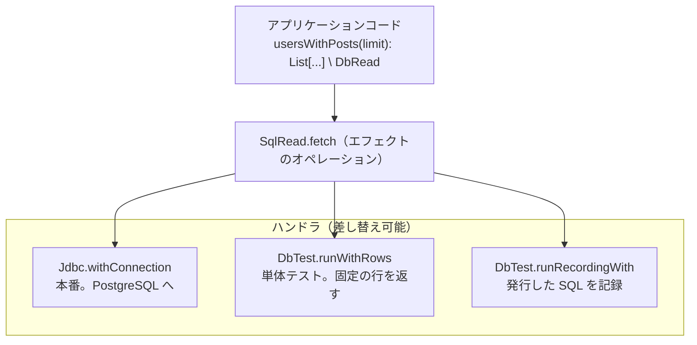
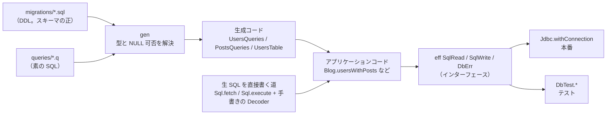
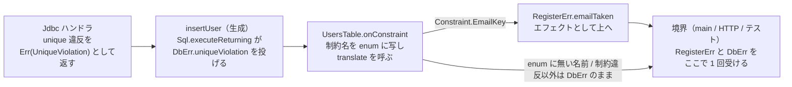
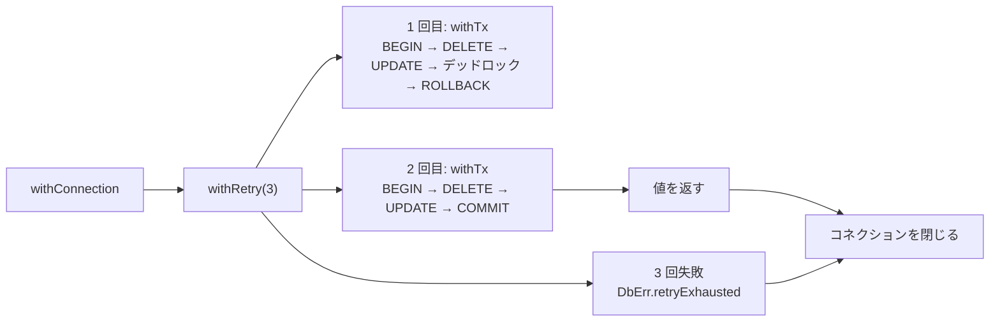

ORM 論争を見て「Flix ならどんな DB ライブラリを作りたいか」を考え、叩き台を作ったので意見がほしい、という記事です。

## 1. 背景と、この記事で伝えたいこと

:::message
この記事で扱う **sqlfx** は、Flix で書いた実験的な DB ライブラリの叩き台です。コネクションプール、マイグレーション、ストリーミング、実 DB への PREPARE 検証はまだ実装していません。「使ってください」ではなく「Flix ならこういう形はどうか」を見てもらい、意見をもらうための記事です。
:::

先に、sqlfx で書いたコードがどう見えるかを示します。SQL を書き、生成された関数を呼び、DB 無しでテストするまでです。

```sql:users.q
-- :limit は引数、{filter} {order} は動的な部分の差し込み口
query searchUsers(limit: Int64) -> many with filter: Pred[users], order: Order[users] {
    SELECT id, name, email, role FROM users
    WHERE deleted_at IS NULL AND {filter}
    {order}
    LIMIT :limit
}
```

```scala:Blog.flix
// 生成される関数。\ DbRead は「DB を読む」というエフェクト
pub def searchUsers(limit: Int64, filter: Pred[UsersTable], order: Order[UsersTable]): List[SearchUsersRow] \ DbRead

// 動的な条件を型付きの値で組む
def activeUsersNamed(search: { prefix = String, limit = Int64 }): List[SearchUsersRow] \ DbRead =
    UsersQueries.searchUsers(
        search#limit,                                                                   // # はレコードのフィールド参照
        Fragment.when(search#prefix != "", Fragment.like(UsersTable.name(), search#prefix + "%")),
        Fragment.asc(UsersTable.name()))

// 記事を一括取得し、ユーザーごとにグルーピングして UserWithPosts にマッピングする（プリロード）
def usersWithPosts(limit: Int64): List[UserWithPosts] \ DbRead =
    let users = UsersQueries.searchUsers(limit, Fragment.always(), Fragment.asc(UsersTable.id()));
    let posts = PostsQueries.postsByUsers(List.map(user -> user#id, users));
    Preload.attach({ parents = users, parentKey = user -> user#id, children = posts, childKey = post -> post#userId })
        |> List.map(pair -> { let (user, theirs) = pair; { user = user, posts = theirs } })

// DB 無しでクエリ数を検証する。runRecordingWith は発行した SQL を記録するテスト用ハンドラ
@Test
def testUsersWithPostsIsTwoQueries(): Unit \ Assert =
    let (_, statements) = DbTest.runRecordingWith(BlogRows.tableFor(BlogRows.sample()), 0, () ->
        DbError.runWithFailure(() -> usersWithPosts(10i64)));                              // 10i64 は Int64 の 10
    Assert.assertEq(expected = 2, List.length(statements))
```

`\ DbRead` は関数に書きます。書き忘れると純粋な関数と見なされ、本体で DB を読んだ時点でコンパイルエラーになります。`UsersQueries` / `PostsQueries` / `UsersTable` は `.q` と DDL から生成したモジュールです。

ORM は必要か、生 SQL に戻るべきか、という議論を見かけました。ashunar0 さんの「[ORM が引き受けている責務を分解してみる](https://ashunar0.dev/posts/orm-responsibilities/)」は、この議論を 7 つの責務に分けて整理し、「どれを何に任せるかは組み合わせの問題」と結論しています。これを読んで、自分が普段触っている Flix ならどんなライブラリが良いか、自分ならどんなライブラリを作ってみたいかを考え、実際に叩き台を作ってみました。

先に表記の但し書きです。この記事では「ORM」と書きますが、Flix はオブジェクト指向プログラミングをしない言語で、sqlfx もオブジェクトにリレーションをマッピングしません。正確には「DB ライブラリ」あるいは「DB フレームワーク」と呼ぶべきですが、分かりやすさと短さのために ORM と表記します。また Flix は JVM 上で動く言語で、Java のライブラリをそのまま呼べます。sqlfx の本番ハンドラは PostgreSQL 公式の JDBC ドライバ（pgjdbc）を薄くラップした物で、接続文字列も `jdbc:postgresql://...` です。

元の記事の a〜g の分類を借りて、sqlfx の立場を示します。

| 責務 | sqlfx |
|---|---|
| a. クエリの組み立て | 持たない。SQL はそのまま書く。WHERE と ORDER BY の動的な部分だけ、型付きの小さなフラグメント DSL で組む |
| b. 行とオブジェクトの変換 | 読み取り方向のみ。行 → レコードのデコーダを生成する。オブジェクトからの書き戻しは無い |
| c. 関連の解決 | 持たない。`user.posts` のような lazy loading は無く、2 クエリで一括取得してアプリ側でグルーピングする（プリロード。`keyed` からのプリローダ生成は未実装） |
| d. スキーマの単一情報源 | マイグレーションの DDL を正とする。DDL をパースして型と NULL 可否を導出する（式の列は `::bigint` のような型指定が必要） |
| e. マイグレーション | 未実装 |
| f. インジェクション対策 | フラグメント DSL の中では、値は必ずプレースホルダになり、識別子は生成コードで定義された列だけを使う。生 SQL を渡す入口（`Sql.fetch` / `Fragment.rawPred`）は `RawSql` エフェクトとして型シグネチャに現れる |
| g. トランザクション管理 | 持つ。ネストは未対応（ネストして呼ぶと内側の COMMIT で外側も確定する） |

要するに sqlc に近い立場です。クエリビルダと関連の解決を持たず、マッピングは読み取り方向だけ。ここまでは生 SQL 寄りの典型的な構成で、新しい点はありません。

伝えたいのは、この分類に含まれていない点です。7 つの責務は「ライブラリが何を提供するか」の分類で、**SQL 文の間にあるアプリケーションコードで何が起きうるか**は、どの責務にも含まれていません。ORM を使わない場合に失われる物が 2 つあると考えていて、どちらも SQL 文の間のアプリケーションコードに関する物です。

- この関数が DB に対して何をするのかを、コードを読んで**判断する手段**。読み取りだけなのか、書き込むのか、失敗しうるのか。元の記事の「クエリビルダくらいの制約は欲しい」という意見に対応します
- DB 無しで、ロジックとクエリ数を**テストする手段**。これは元の記事の 7 つには無い論点で、私が追加した物です

この 2 つを、ライブラリの機能ではなく Flix の言語機能（代数的エフェクト）で実現できるのではないか、というのがこの叩き台の主張です。

```
ORM 論争の軸       SQL を隠す ◀───────────────────────────▶ SQL をそのまま書く
                   ActiveRecord   Prisma   Drizzle   Kysely   sqlc / sqlx / 生 SQL

追加したい軸       SQL 文の間のコードの副作用が、関数の型シグネチャに現れるか
                     \ DbRead    読み取りのみ
                     \ DbWrite   書き込み
                     どちらも失敗しうる。失敗は別のエフェクト DbErr のオペレーションとしてハンドラまで伝わる
```

*図 1: ORM 論争の軸と直交する軸を 1 つ追加する*

## 2. DB 無しで N+1 を数える

冒頭の `usersWithPosts` は、ユーザーを取得してから、その id で記事をまとめて取得する 2 クエリの関数です。記事を取得する `.q` は次の通りで、`Preload.attach` は子の行を親のキーでグルーピングするライブラリ関数です。

```sql:posts.q
query postsByUsers(ids: List[Int64]) -> many keyed(user_id) {
    SELECT id, user_id, title, published, views FROM posts WHERE user_id = ANY(:ids) ORDER BY id
}
```

`usersWithPosts` が本当に 2 クエリで済んでいるかを、DB 無しで検証できます。冒頭のテストに加えて、グルーピングの結果も検証するテストです。

```scala:TestGeneratedPure.flix
/// プリロード: ユーザーが 3 人でもクエリは 2 つ、記事はユーザーごとに id 順、記事の無いユーザーは Nil。
@Test
def testUsersWithPostsIsTwoQueries(): Unit \ Assert =
    let (grouped, statements) = DbTest.runRecordingWith(BlogRows.tableFor(BlogRows.sample()), 0, () ->
        DbError.runWithFailure(() -> Blog.usersWithPosts(10i64)));
    let shape = Result.map(List.map(entry -> (entry#user#name, List.map(post -> post#id, entry#posts))), grouped);
    Assert.assertEq(
        expected = (Ok(List#{("alice", List#{10i64, 11i64}), ("bob", Nil), ("carol", List#{12i64})}), 2),
        (shape, List.length(statements)))
```

同じ `usersWithPosts` を、ハンドラだけ PostgreSQL に接続する物に替えて実 DB でも実行します。テスト側で違うのは、固定データを投入する `withSeed` だけです。

```scala:TestQueriesPg.flix
@Test
def testUsersWithPosts(): Unit \ {Assert, IO, Fs.FileRead.FileRead} =
    let result = BlogTestSupport.withSeed(() ->
        Blog.usersWithPosts(10i64) |> List.map(entry -> (entry#user#name, List.map(post -> post#title, entry#posts))));
    Assert.assertEq(expected = Ok(List#{
        ("alice", List#{"Hello", "Second"}),
        ("bob", List#{"Draft"}),
        ("carol", Nil)
    }), result)
```

なぜ `usersWithPosts` を変えずに済むのか。`usersWithPosts` が呼ぶ `SqlRead.fetch` はエフェクトのオペレーションで、その実装は「ハンドラ」が与えます。ハンドラはインターフェースを実装したオブジェクトを引数で渡す物ではなく、**関数を呼び出す側が `run { ... } with handler` で囲んで、そのスコープ内で有効な実装を与える物**です。DI の注入先がコンストラクタではなく呼び出しのスコープになる、と考えてください。



*図 2: 関数側にもテスト側にも追加の仕組みが要らない。DB エラーの効果は `DbError.runWithFailure` で境界で受ける（4 節）*

DI コンテナも、モックライブラリも要りません。クエリ関数はコネクションを知らず、コネクションを扱うのはハンドラを適用する境界の関数だけです。

lazy loading が無いので、暗黙にクエリが発行されることはありません。ループの中でクエリ関数を呼べば N+1 を書くことはできますが、それはコード上に明示的に現れ、クエリ数を 2 と期待している上のテストが失敗します。ORM の N+1 は実行時のログや警告で検知する物でしたが、ここでは単体テストで検出できます。なお、このテスト用ハンドラは SQL 文字列を見て行を選ぶ簡易な物で、検証しているのはクエリ数とグルーピングの結果です。行の内容は上の実 PG のテストで確認しています。

TypeScript の Effect や Scala の ZIO でも、必要な依存を型パラメータに載せれば同じ分離はできます。違いは、sqlfx の関数が通常の関数のままである点です。`Effect.gen` や `for` 内包表記のようなラッパー型の中で書く必要がなく、`flatMap` で繋ぐ必要もありません。`usersWithPosts` の本体は直接スタイルで書けます。`\ DbRead` は関数のシグネチャに書く必要がありますが、書き忘れや不足はコンパイルエラーになるので、シグネチャと本体の食い違いは残りません。

## 3. なぜできるのか: 読み取りと書き込みが型シグネチャに出る

Flix には代数的エフェクトがあります。仕組みの説明はせず、sqlfx がそれを何に使っているかだけ示します。DB の読み取りと書き込みを `eff` として宣言し、関数はそのオペレーションを呼びます。

```scala:Sql.flix
/// DB から読む境界。SELECT だけを発行する
pub eff SqlRead {
    def fetch(sql: String, params: List[SqlValue]): Result[DbErrorKind, List[Row]]
}

/// DB へ書く境界。INSERT / UPDATE / DELETE を発行する
pub eff SqlWrite {
    def execute(sql: String, params: List[SqlValue]): Result[DbErrorKind, Int32]
    def executeReturning(sql: String, params: List[SqlValue]): Result[DbErrorKind, List[Row]]
}

pub type alias DbRead  = {SqlRead, TransientDbErr, DbErr}
pub type alias DbWrite = {SqlWrite, TransientDbErr, DbErr}
```

この宣言がインターフェースで、実装は 2 節のハンドラが与えます。関数が `SqlRead.fetch` を呼べば、その関数の型シグネチャの `\` 以降に `SqlRead` が付きます。`\` 以降は、その関数が使う代数的エフェクトの一覧です。`TransientDbErr`（デッドロック、タイムアウト、切断）と `DbErr`（それ以外の DB エラー）はエラー用のエフェクトで、4 節で扱います。

オペレーションが `Result` を返しているのは、Flix のハンドラの評価順序による物です。ハンドラ本体で投げたエフェクトは `run` の外側のハンドラに渡るので、JDBC ハンドラは失敗を値で返し、`Sql.fetch` などのラッパ関数が呼び出し側のスコープで `DbErr` のオペレーションに変換します。利用者はラッパを使うので、`Result` を見ることはありません。



*図 3: 生成コードも生 SQL も同じエフェクトを呼ぶ。ハンドラは共通*

SQL 自体は `.q` ファイルにそのまま書きます。マイグレーションの DDL からスキーマ情報をパースし、SELECT 句の列をそれに照合して、行のレコード型と型付きの関数を生成します（`make gen`）。`.q` ごとに `XxxQueries` モジュール、テーブルごとに列を表す `XxxTable` モジュールが生成されます。

```sql:users.q
query findUser(id: Int64) -> one {
    SELECT id, name, email, role FROM users WHERE id = :id AND deleted_at IS NULL
}
```

```scala:UsersQueries.flix（生成物）
pub type alias FindUserRow = { id = Int64, name = String, email = Option[String], role = String }
pub def findUser(id: Int64): Option[FindUserRow] \ DbRead
```

email は DDL で NULL 可なので `Option`、0 行の場合も `Option` です。生成器が SQL の先頭のキーワードを見て、SELECT なら `DbRead`、INSERT / UPDATE / DELETE なら `DbWrite` を付けます。

動的な条件は `{slot}` として宣言し、フラグメント DSL で組んだ値を渡します。冒頭の `searchUsers` と `activeUsersNamed` がその例です。列は生成された `UsersTable.name()` からしか来ないので、動的条件でも識別子の混入は起きません。値は必ずプレースホルダになります。

列の型はテーブル・Flix の型・NULL 可否の 3 つを持ち、DDL の `NOT NULL` を生成器が写します。比較は左に列、右に列か `Fragment.value(x)` を置き、型が合わないとコンパイルエラーになります。`>` などは Flix の組み込みなので、`=` と `<>` は Slick と同じ `===` `=!=`、順序は文字を重ねた `<<` `<<=` `>>` `>>=` です。

```scala
use Fragment.{===, >>}

UsersTable.id() === Fragment.value(3i64)           // (id = $1)
UsersTable.deletedAt() >> UsersTable.createdAt()   // (deleted_at > created_at)
Fragment.isNotNull(UsersTable.email())             // email は NULL 可なので書ける

Fragment.isNotNull(UsersTable.name())              // コンパイルエラー。name は NOT NULL
PostsTable.views() >> PostsTable.title()           // コンパイルエラー。Int32 と String
PostsTable.userId() === UsersTable.id()            // コンパイルエラー。テーブルが違う
```

型が保証している範囲は正確に書いておきます。生成された書き込み関数（`softDeleteUser` など）を `\ DbRead` の関数から呼ぶと、`SqlWrite` が型に無いのでコンパイルエラーになります。読み書きの区別は生成器が SQL の先頭のキーワードで付けた物で、生の文字列を `Sql.fetch` に渡せば書き込みも通ります。その代わり、`Sql.fetch` のように生の文字列を渡す入口と、生 SQL をフラグメントに入れる `Fragment.rawPred` には `RawSql` エフェクトが付き、呼び出し側の関数の型にも伝わります。生 SQL を使った箇所は型シグネチャから列挙でき、境界で `RawSql.runWithAllow` を書いた所が監査点になります。`RawSql` は防止ではなく責任の所在を示す物で、書ける SQL は変わりません。

読み書きをファントム型で分けた例は Slick 3 の `Effect.Read / Effect.Write` に、実装を差し替えてテストする例は Doobie の `Transactor` にあります。sqlfx の違いは、関数側が `\ DbRead` と書くだけで、`DBIO` や `ConnectionIO` でコードをラップせずに済むことと、次に示すようにエラーも戻り値ではなく代数的エフェクトで扱えることです。ORM のクエリビルダが与える制約は「このメソッドしか呼べない」という制約でした。sqlfx の制約は「何を書いてもよいが、その副作用が型に現れる」という制約です。

## 4. DB エラーも代数的エフェクトで扱う

DB のエラーもエフェクトです。

```scala:DbError.flix
/// 再実行しても直らない DB エラー。制約違反はアプリ側で分岐したい物だけハンドラで受け取り、それ以外は境界でハンドリングする
pub eff DbErr {
    def uniqueViolation(constraint: String): Void
    def foreignKeyViolation(constraint: String): Void
    def checkViolation(constraint: String): Void
    def notNullViolation(column: String): Void
    def schemaMismatch(detail: String): Void
    def decodeError(column: String, detail: String): Void
    def retryExhausted(last: String): Void
    def other(detail: String): Void
}
```

`Void` は値が存在しない型なので、このオペレーションから値が返ってくることはありません。呼んだ場所には戻らず、`DbErr` のハンドラまで呼び出し元を遡って伝わります。途中の関数は型に `DbErr` が付くだけで、本体には何も書きません。呼び出しごとに `Result` をアンラップする必要はなく、ハンドリングしたい場所でだけ受け取ります。

業務エラー（email の重複、name の長さ超過）は DB の制約違反から翻訳します。生成器は DDL の名前付き制約をテーブルごとの enum にし、翻訳しながら書き込む `onConstraint` を出します。業務エラーも `DbErr` と同じくエフェクトにすると、途中の関数は戻り値を包まず、境界で 1 回ハンドリングするだけになります。

```scala:Blog.flix
pub eff RegisterErr {
    def emailTaken(email: String): Void
    def nameTooLong(): Void
}

pub def registerUser(user: NewUser): Int64 \ DbWrite + RegisterErr =
    UsersTable.onConstraint(translateUserConstraint(user), () ->
        UsersQueries.insertUser({ name = user#name, email = user#email, role = "member" }) |> expectRow)

// users の制約は DDL から enum になっている。case が足りなければコンパイルエラー
def translateUserConstraint(user: NewUser, constraint: UsersTable.Constraint): a \ RegisterErr = match constraint {
    case UsersTable.Constraint.EmailKey => RegisterErr.emailTaken(user#email)      // CONSTRAINT users_email_key UNIQUE (email)
    case UsersTable.Constraint.NameLength => RegisterErr.nameTooLong()             // CONSTRAINT users_name_length CHECK (length(name) <= 50)
}
```

`insertUser` は `INSERT ... RETURNING id` を `-> one` で宣言した `.q` から生成した関数です。制約名は PostgreSQL がエラー情報の一部として返す物（pgjdbc の `ServerErrorMessage`）を生成された enum に写します。DDL に制約を足して再生成すると、そのテーブルに書く箇所すべてが新しい case を書くまでコンパイルが通りません。enum に無い名前の違反と、制約違反以外の DB エラーは翻訳されず、`DbErr` のまま上へ流れます。



*図 4: DB エラーはハンドラに届くまで呼び出し元を遡る。制約違反は生成された enum で業務エラーに翻訳し、どちらも境界で受ける*

この翻訳も DB 無しでテストできます。「書き込みが制約違反を返す」ハンドラ `DbTest.runFailingWrite` を被せるだけです。

```scala:TestGeneratedPure.flix
let register = () -> DbError.runWithFailure(() -> Blog.runRegister(() -> Blog.registerUser(alice)));
let taken = DbTest.runFailingWrite(DbErrorKind.UniqueViolation("users_email_key"), register);
let tooLong = DbTest.runFailingWrite(DbErrorKind.CheckViolation("users_name_length"), register);
Assert.assertEq(
    expected = (Ok(Err(RegisterFailure.EmailTaken("alice@example.com"))), Ok(Err(RegisterFailure.NameTooLong))),
    (taken, tooLong))
```

`Blog.runRegister` は `RegisterErr` を `Result` に落とす境界用の関数です。`runFailingWrite` の中身は `SqlWrite` のハンドラで、各オペレーションは第 3 引数に `resume` を受け取り、`resume(Err(...))` で失敗を値としてオペレーションを呼んだ場所へ返します。モックの return に相当します。

## 5. トランザクションと境界

コネクション、リトライ、トランザクションは境界の関数で構成します。クエリ関数はコネクションを知らず、`Connection` を扱うのはここだけです。

```scala
Jdbc.withConnection(config, conn ->                 // コネクションを開き、終了時に必ず閉じる
    Retry.withRetry(3, () ->                        // 一時的なエラーなら最初からリトライする
        Tx.withTx(conn, () ->                       // BEGIN / COMMIT。失敗時は ROLLBACK してエラーを投げ直す
            Blog.removeUser(1i64))))
```



*図 5: リトライはトランザクション単位。PostgreSQL はデッドロック後にトランザクション全体が中断されるので、文単位のリトライは意味を持たない*

正直に書いておくと、`removeUser` を「トランザクションの中で呼ぶこと」は、今はコードのドキュメントコメントに書いてあるだけで、型には出ていません。`Jdbc.withConnection` の直下で呼んでもコンパイルが通ります。トランザクションの内外をマーカーとなるエフェクトで型に出す設計は決めていますが、未実装です。ネストも未対応で、ネストして呼ぶと内側の COMMIT で外側も確定します。

## 6. まとめと、意見がほしいこと

「ORM は必要か」という問いは、責務ごとに分ければ別々の問いになる、というのが元の記事の結論でした。そこに 1 つ追加したい問いがあります。**SQL 文の間のアプリケーションコードで何が起きうるかを、誰が保証するのか。**

ORM はその保証をメソッドの制限で与え、生 SQL は何も保証しませんでした。代数的エフェクトのある言語なら、関数の型シグネチャが保証できます。元の記事の「AI が書くなら」という論点にも同じ答えになります。エージェントに渡す物は DDL と `.q` という 2 種類のテキストで、生成コードの型シグネチャがレビューの対象になります。sqlfx はこの考えを Flix で試した叩き台です。

2 節から 5 節を振り返ると、sqlfx の考え方に真新しい物はありません。読み書きを型で分けることも、実装を差し替えてテストすることも、先行例があります。それでも Flix で書くと違って見えるのは、代数的エフェクトが言語に組み込まれていて、戻り値の型とエフェクトの型が `List[User] \ DbRead` のように分離されるからです。Doobie の `ConnectionIO[List[User]]` や Effect の `Effect<List<User>, E, R>` のように戻り値をライブラリの型で包む必要がなく、モナドやラッパー型が関数のシグネチャに現れません。ハンドラの差し替え（2 節）、エラーを `Result` に包まないこと（4 節）、コネクションやトランザクションがクエリ関数のシグネチャに現れないこと（5 節）は、どれもこの分離の結果です。後発の言語としてシンタックスが整理されていること（`run ... with handler` によるスコープ付きの実装差し替え、レコード構文、シグネチャと本体の食い違いを検出するエフェクトの検査）と、JVM 上で pgjdbc をそのまま呼べることも合わさって、ビジネスロジックを通常の関数として書いたまま、DB の副作用とエラーを型で扱えます。

特に意見がほしい点です。

- 読み取り / 書き込みが型シグネチャに現れることは、実際の開発で有用か。Slick 3 の `Effect.Read / Write` はほとんど使われなかったと聞きます。コンパイラが不足を検出してくれるなら事情が違うのか、それでも煩わしいか
- クエリビルダを持たず、SQL をそのまま `.q` に書く形は、どの規模のプロジェクトまで通用するか。私の見立ては「SQL を書ける人がいる小〜中規模」です
- DB エラーを戻り値ではなく代数的エフェクトで扱う形は、`Result` を返す形と比べて読みやすいか

コードは [GitHub の ababup1192/sqlfx](https://github.com/ababup1192/sqlfx) にあります。`examples/blog` に、生成コード版と生 SQL 版を並べたデモと、この記事に載せたテストがそのまま入っています。JDK 17 と Docker があれば `make test-pg` で PostgreSQL を起動して全テストを実行でき、DB 無しのテストは `make test-unit` だけで実行できます。
